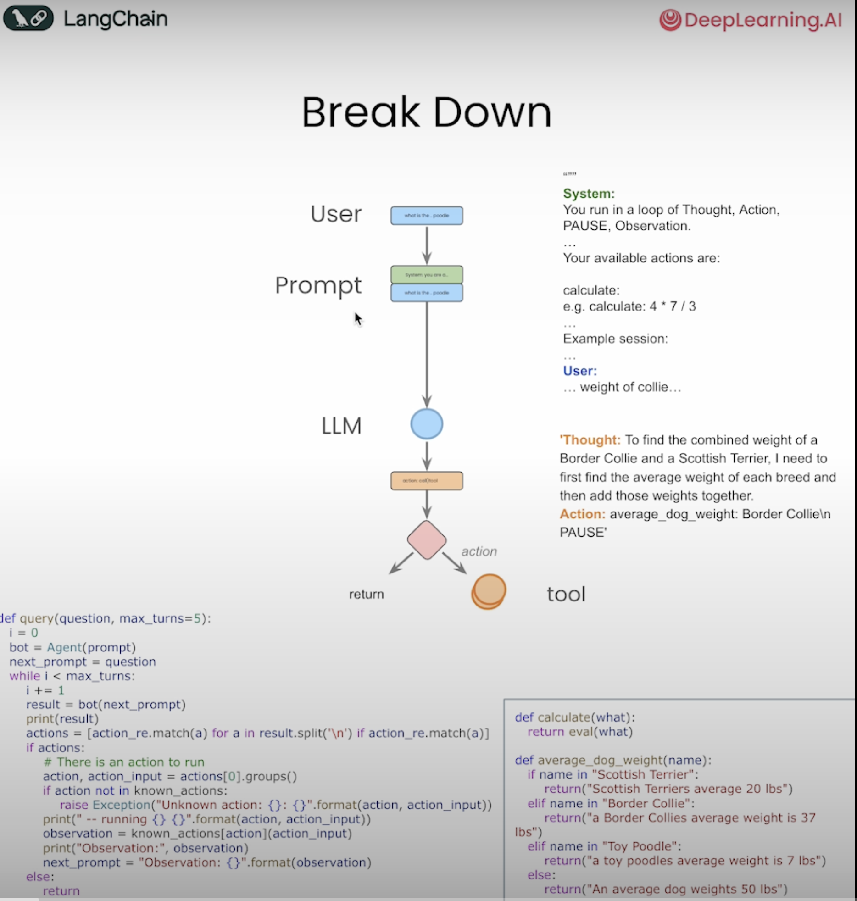
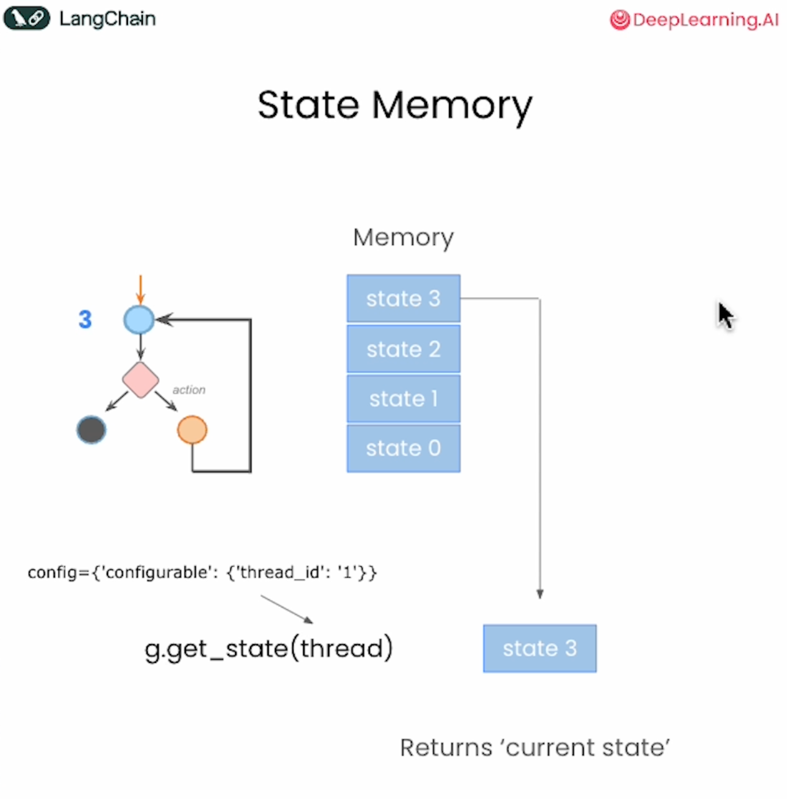

# AI Agents


## Llama as a System

https://github.com/meta-llama/llama-agentic-system

```python
!pip install llama-agentic-system


# download the 8B model, this can be run on a single GPU
llama download meta-llama/Meta-Llama-3.1-8B-Instruct

# llama-agents have safety enabled by default. For this you will need
# safety models -- Llama-Guard and Prompt-Guard
llama download meta-llama/Prompt-Guard-86M --ignore-patterns original
llama download meta-llama/Llama-Guard-3-8B --ignore-patterns original

#Configure Inference Server Config
llama inference configure

#Run Inference Server
llama inference start

#Configure Agentic System
llama agentic_system configure

#Start an App and Interact with the Server
mesop app/main.py
```

This will start a mesop app and you can go to `localhost:32123` to play with the chat interface.


## LangGraph







## References:

- https://learn.deeplearning.ai/courses/ai-agents-in-langgraph/lesson/1/introduction