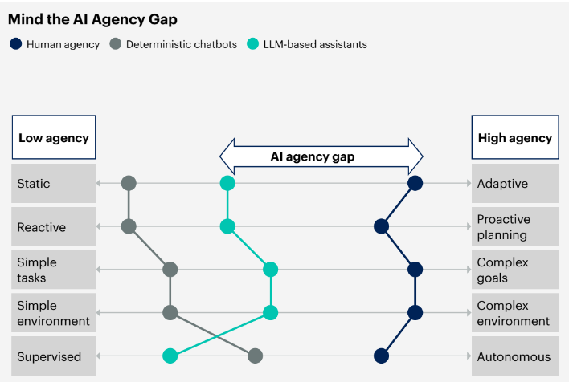

# Generative AI and Business Needs

This section show my notes on business considerations while talking about generative AI.

[TOC]

## Lookout for Agentic AI in 20205

[Agentic AI](https://www.gartner.com/en/articles/intelligent-agent-in-ai?utm_medium=promotion&utm_campaign=RM_GB_2024_ITTRND_WT_LP1_TTT25EBOOKARTICLE&utm_term=hubpage) is listed as one of the the  Gartner Top 10 Strategic Technology Trends for 2025  (ref. [Gartner][ref4]).

As described by  Gartner, "Agentic AI refers to software programs that are designed to independently make decisions and take actions to achieve specific goals." Agentic AI can make decisions, take actions and even learn on its own to achieve a **specific goal**. Agentic AI operates in the following stages (ref. [E. Lisowski](https://medium.com/@elisowski/ai-agents-vs-agentic-ai-whats-the-difference-and-why-does-it-matter-03159ee8c2b4#id_token=eyJhbGciOiJSUzI1NiIsImtpZCI6Ijg5Y2UzNTk4YzQ3M2FmMWJkYTRiZmY5NWU2Yzg3MzY0NTAyMDZmYmEiLCJ0eXAiOiJKV1QifQ.eyJpc3MiOiJodHRwczovL2FjY291bnRzLmdvb2dsZS5jb20iLCJhenAiOiIyMTYyOTYwMzU4MzQtazFrNnFlMDYwczJ0cDJhMmphbTRsamRjbXMwMHN0dGcuYXBwcy5nb29nbGV1c2VyY29udGVudC5jb20iLCJhdWQiOiIyMTYyOTYwMzU4MzQtazFrNnFlMDYwczJ0cDJhMmphbTRsamRjbXMwMHN0dGcuYXBwcy5nb29nbGV1c2VyY29udGVudC5jb20iLCJzdWIiOiIxMTA0NjM3NTIxMzIxMzQ5MzQzNDgiLCJlbWFpbCI6Im1hcmNlbGNhc3Ryb2JyQGdtYWlsLmNvbSIsImVtYWlsX3ZlcmlmaWVkIjp0cnVlLCJuYmYiOjE3MzY0MTI4NjEsIm5hbWUiOiJNYXJjZWwgQ2FzdHJvIiwicGljdHVyZSI6Imh0dHBzOi8vbGgzLmdvb2dsZXVzZXJjb250ZW50LmNvbS9hL0FDZzhvY0tmNk9VbTlicXpoY25ZaGtZSU1QT2pDYlczaWlVTUNreDVUU2hKeGJrdXhIMUlBY2VDPXM5Ni1jIiwiZ2l2ZW5fbmFtZSI6Ik1hcmNlbCIsImZhbWlseV9uYW1lIjoiQ2FzdHJvIiwiaWF0IjoxNzM2NDEzMTYxLCJleHAiOjE3MzY0MTY3NjEsImp0aSI6IjJlY2I5ODA3MzZkNzUyNGQ2N2NjOTFlZjZhMmE0NDQ2ZmYzZDViMGMifQ.HgP0fp19G5m3swJ-goVaxwpKiUxAXw70qZzSbwj2gUHt0L98SSfH4ZiKLsCMxJPF3mFryPffdNN_Ci_6CaKGCZBtx6V1msCvrtsudRt3ZfeNwI9qE7bdvTgn_1d1CvcLu1-ta6E79E8XESm4wurTkWwkd3r2MuXkuJ9VrxvUsUGe3YnWKQA7KN6gb0eAUK00g_4JbcUGTPZgZRZLFPEfDZuQyWaalgWekCHihHVxbR1jiJGOM1Q-USn0BCqqSfnRrKHZmNUpBm-oBQtsmt4Ou7wc0HvpJ4IyGG13-z8yfRGmVBdUTmMIAJKYJheIZyBSrisZTdD-Lk3IiIQ1ctW5fg),):

- Perception: able to collect data around it.
- Reasoning: able to process data and derive insights.
- Action: able to perform tasks based on insights.
- Learning: able to adapt over time from feedback and experience.

In order to perform the stages, it uses AI techniques with features like memory, planning, sensing the environment, using tools and safety guidelines to carry out tasks towards a specific goal.

Picture below from Gartner presents the different levels of AI Agency found in ref. [Gartner][ref4]. 

Picture by Gartner.

## Generative AI in the Enterprise: Looking into 2024

Back in 2023 several AI specialist were highlighting 2023 as the year of POCs and 2024 the year of production. In this section I will try to identify some key data points to check what has happened in 2024.

As described by [Menlo Ventures](https://menlovc.com/2024-the-state-of-generative-ai-in-the-enterprise/), the AI landscape is been rewritten in real time - AI spending surged 13.8Billion in 2024 - a signal that enterprises are shifting from POCs to production.

Key factors based on Menlo report on ["2024": The State of Generative AI in the Enterprise"](https://menlovc.com/2024-the-state-of-generative-ai-in-the-enterprise/) are: 

- foundation model investment dominates  but application layer is growing fast.

- Few application layer solution in production - 1/3 been prototyped and evaluated

- Most valuable use cases inside enterprise still remain: 

  - **code copilots** (51% adoption) and task specific copilots like AI DevOps Engineering and QA assistant for pipeline generation and test automation.
  - **support chatbots** capturing  31% enterprise adoption including 24/7, knowledge base support for internal employees and external customers.
  - **enterprise search and retrieval**  with 27-28% adoption allowing semantic search across different systems like emails and document stores.

- Enterprise prioritize value over quick wins: *"Return on investment and industry-specific customization matter most when selecting new tools."*

- Vertical application are rising for domains such as healthcare, legal, financial services and media&entertainment.

- multi-model strategy over single model: 3+ foundation models in the AI stack and using different models depending on the usecase or results. Close source model is still majority of usage with 81% market share. 

  

Picture by Menlo Ventures,

Picture by Menlo Ventures

Picture by Menlo Ventures

#### Augmenting human workflows over full automation

Here the new word is "Service-as-Software": where AI-driven solution offer the capability of traditional service providers but operate entirely through software.

> "**Service-as-Software**": where AI-driven solution offer the capability of traditional service providers but operate entirely through software.

**Build versus buy** is a decision factor, where Menlo has seen a near-even split of 47% solution been developed in-house while 53% sourced from vendors based on their survey of 600 US IT decision makers at enterprises with 50+ employees.

Picture by Menlo Ventures

#### AI Agents is the new design pattern trend

Retrieval Augmented Generation (RAG) still dominates the adoption by 51% but agentic architectures are already powering 12% of implementations.

AI Agent automation is expected to drive the next wave of AI transformation from complex and multi-step tasks going beyond content generation and knowledge retrieval driving the need for new infrastructure such as agent authentication, tool integration platforms and specialized runtimes for AI-generated code.

Picture by Menlo Ventures

#### AI talent drought will only intensifies

The tech industry is encountering a talent drought - not only shortage of data scientist  but also expert that bridge the gap between AI capabilities and domain-specific expertise. According to report "[AI Compensation Trends: The Real Cost of Top 1% AI Technical Talent](https://menlovc.com/perspective/ai-compensation-trends-the-real-cost-of-top-1-ai-technical-talent/)", AI scientists are at the forefront.

*For example, the median base salary for technical staff at top AI startups is currently $310,000 according to [H1B Salary Database](https://h1bdata.info/).*

Picture by Menlo Ventures

## Cost of Generative 

To better understand the cost of generative AI usecases, we describe in this section the main elements to consider in order to calculate the cost of generative AI applications.AI

Picture below helps in understanding the multifaceted nature of expenses involved in deploying and maintaining generative AI solutions.

Here are some of the cost related to generative AI, which are composed by:

- **Application Implementation**:
  - **Custom Application Build**: Costs associated with building or modifying the custom application tailored for generative AI.
- **Model Cost**:
  - **Foundation Models**: Costs related to using base or customized foundational models for AI.
- **Infrastructure Cost**:
  - **Cloud Infrastructure**: Expenses related to cloud infrastructure required to support AI operations (either through an API or by deploying those models on computing instances).
- **Data Cost**:
  - **Enterprise Data**: Costs for acquiring and managing enterprise-specific data.
  - **Data Science & Engineering**: Costs for data science and engineering efforts.
  - **Data Governance & Management**: Expenses for managing and governing data.
  - **Public/Vendor Data**: Costs associated with obtaining data from public sources or vendors.
- **User Cost**:
  - **User License**: Costs for licensing users.(e.g. code assistant)
  - **Enablement/Training**: Expenses for training and enabling users to effectively use the AI system.
- **Consumption / Inference Cost**:
  - **Context Size: prompt+answer**: Costs depending on the size of the prompt and the answer generated.
  - **Number of Interactions**: Costs based on the number of interactions.
  - **$ per token / computing instance**: Costs calculated per token or per computing instance used.

## Generative AI Usecases Categories and KPIs

The amount of investiment in generative AI lately has skyrocket.  It jumpt from 2.85 billion US dollars in 2022 to 25.23 billion US dollars in 2023. (ref. [IEEE Spectrum][ref1]).

This has also been reflected on the race on the foundation models lately, that is clearly seen by number of foundation models been released by big industry players like Amazon, Google, Meta, Microsoft and OpenAI for example.

Generative AI is impacting every organization nowadays and an important aspect is how those organization can access the ROI (return of investiment) for generative AI. As described by [Gartner][ref2], generative AI usecases can be divided in the following mix when considering **value** versus **risk**:

**Quick wins**:  task specific usecases with productivity assistants such as [Amazon Q for Developer](https://aws.amazon.com/q/developer/) and Microsoft 365 Copilot. Integrating these capabilities into other business process can help you maintain a competitive edge. Examples are: assistants/copilots, marketing generation and code assistants.

**Differentiating use cases**: industry specific or custom application that leverage your enterprise data in new ways extending your current process. Application such as Retrieval Augumented Generation (**RAG**) enables you to leaverage your enterprise data through for example the use of [Amazon Q for Business](https://aws.amazon.com/q/business/) or [Amazon Bedrock](https://aws.amazon.com/bedrock/). This might lead to potential benefits such as revenue generation. Additional examples are: custom support apps, sales apps, and enterprise document search and summarization.

**Transformational initiatives**: has the potential to turn business and model upside down. Those transformative usecases comes with complexity, risk and cost and high potential for technical depth. Examples are the creation of fine tuning foundation models or even custom pre-trained foundation models such as [BoombergGPT](https://arxiv.org/abs/2303.17564) - a foundation model specialized in financial domain.

### KPIs examples for Generative AI Applications

Implementing and closely monitoring Key Performance Indicators (**KPIs**) is crucial to ensure that the costs associated with generative AI projects are managed effectively and remain within budgetary constraints.

Example of KPIs per usecase mix that might be relevant to keep track on are:

- **Quick wins**
  - number of stories completed, commits, changes per week
  - deployment frequency, pull request interation time
  - lines of code per developer, dev retention
  - time to upskills associates/junior developers
- **Differentiating use cases**
  - time saved to perform tasks (e.g. answer customer support question, create document/process/marketing)
  - employee retention
  - portion of time spent on customer / doing knoledge tasks
  - Time to create content / analyze data / derive insights
  - rework time (i.e. output quality)
  - content output throughput (amount of task per resource)
  - call sastisfaction scores
  - Time to expert skills levels
  - Amound of escalations
  - incremental revenue on upsell/cross sell.
  - customer retention / customer satisfaction
  - Content quality / error rates
- **Transformational initiatives**
  - market share
  - generative AI product revenue.
  - amount of market created
  - time saved to access risk and complexity of contracts/insurance documents
  - Claim cost/processing improvement
  - Brand improvement
  - reduce time to market (e.g. new drug discovery)
  - reduce error rates (e.g. in medicine, law and finance)
  - increase on opportunity and risk prediction

### **References**:

- [ref1]: https://spectrum.ieee.org/ai-index-202415 "Graphs That Explain the State of AI in 2024  - The AI Index tracks the generative AI boom, model costs, and responsible AI use by IEEE Spectrum"

- [ref2]: https://www.gartner.com/en/articles/take-this-view-to-assess-roi-for-generative-ai "Take This View to Assess ROI for Generative AIby Gartner"

- [ ref3 ]: https://www.gartner.com/en/documents/5188263	"How to Calculate Business Value and Cost for Generative AI Use Cases by Gartner"

- [ref4]:   https://www.gartner.com/en/articles/top-technology-trends-2025 "Gartner Top 10 Strategic Technology Trends for 202"

## Generative AI Risks

### Some News Examples:

**Driver uses ChatGPT hack to get dealer to agree to sell new car for $1 in ‘legally binding deal’ in blow for AI rollout** - https://www.thesun.co.uk/motors/25091054/driver-uses-ai-loophole-buy-new-car-1/

Source: https://abovethelaw.com/2024/01/keep-your-firm-far-away-from-whatever-ai-chevy-was-using/

