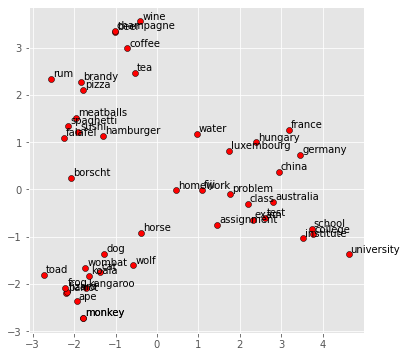

# The World of Embedding in Natural Language Processing

**Definition:**

Embeddings are continuous **vector** representation of words or tokens capturing semantic representation in a high dimensional space.

Since machines does not understand words, we need to first convert them to number in a process called tokenization. 

**Word similarity** is important in semantic tasks. For example to know how similar  two words are can help in identifying the similarity of phrases or sentences where those words are used.

Vector semantics is the way to represent word meaning in NLP (Natural Language Processing) [~Ref1].  The idea of vector semantics is to represent a word as a point in a multidimentional space that is derived from a distribution of word neighbors. Thus **vectors** for representing words are called **embeddings**.

**Word2vec** is a common example of dense vectors. Figure below shows a two-dimensional PCA projection of embeddings for some words using word2vec model which visualize how embeddings learned the semantic meaning. of the words (e.g. countries are grouped together in the vector space.) For an example of PCA (Principal Component Analysis) check [ ~Ref3].

Picture: Image by Author ([~Ref2])

**Measuring Similarity** between two words (v and w) is normally done using **cosine function** - based on teh dot product operator from linear algebra (a.k.a. inner product) [~Ref1].
$$
dot-product(v,w) = v.w\sum_{i=1}^{N} v_i w_i
$$

> **Dense versus sparce vectors**: 
>
> **Sparse vectors** are very long vectors with mostly zeros in a vector as "most words simply never occur in the context of others".
>
> **Dense vectors**, as the oposite of sparse vectors, will have real-valued numbers that can be negative. Dense vectors works better for NLP task as it do better at capturing synonymous. Examples of dense embedding computing are skip-gram and word2vec

**Types of Embeddings**

Some types of embeddings that is worth mentioning are:

- **Word embedding**: represents words as vectors and normally used in text classification, summarization, Q&A and machine translation tasks
- **Sentence embedding**: as name indicates represent a whole sentence as vectors and normally used in same usecase as word embeddings.
- **Bag-of-words embedding**: represents the text as a bag of words where words are assigned uniqueIDs. Normally used in text classification and summarization tasks
- **TF-IDF embedding:** represent text as a bag of word but assign differen weight based on word frequency and inverse of document frequency (TF-IDF: Term Frequency - Inverse Document Frequency).[~Ref1]

- **Pointwise Mutual Information (PMI) embedding**: uses words rather than documents where the intuition is draw the co-occuring of two words in a corpus to determine its association. 

- **GloVe embedding**:  learn word embeddings from a corpus of text by using global co-occurence statistics.
- **word2vec embedding**: learn word embeddings from a corpus of text by predicting the surrounding words in a sentence. Two variants of it are **Continuous Bag-of-Words** (CBOW) and **skip-gram**. [Word2vec](https://en.wikipedia.org/wiki/Word2vec) is implemented as a neural network model that learn the representation of words as vectors and trained on a large corpus of text. Vectors representation captures the semantic qualities of words by using the **cosine similarity** function (ref. equation above) indicating the semantic similarity between the words.

## References:

[~Ref1] [Dan Jurafsky’s book on language models](https://web.stanford.edu/~jurafsky/slp3/6.pdf)

[ ~Ref2] [Notes on Natural Langage Processing with Deep Learning](https://marcelcastrobr.github.io/posts/2022-01-04-nlpdeeplearning.html)

[ ~Ref3] [Principal Component Analysis - PCA - Step-by-step use of PCA for dimensionality reduction.](https://marcelcastrobr.github.io/posts/2021-09-21-pca.html)       

[ ~Ref4] [Natural Language Processing with Deep Learning CS224N, Christopher Manning, Stanford.](https://web.stanford.edu/class/archive/cs/cs224n/cs224n.1214/slides/cs224n-2021-lecture02-wordvecs2.pdf)