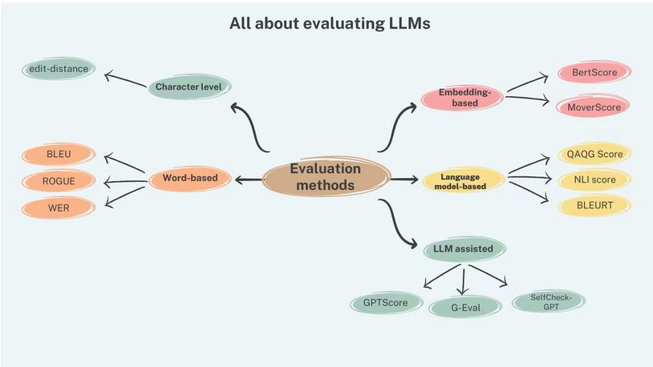
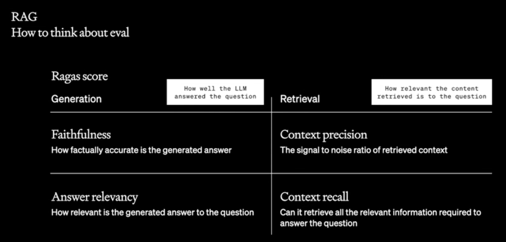
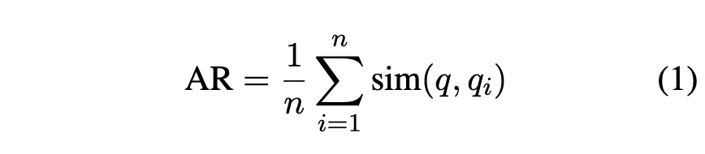

# Evaluating_LLMs



Ref. [All about evaluating Large language models](https://explodinggradients.com/all-about-evaluating-large-language-models)


## Evaluating Embeddings

Ref. [Amazon Bedrock: How good (bad) is Titan Embeddings?](https://www.philschmid.de/amazon-titan-embeddings) 


## Evaluating Models

**TLTR**:

- Benchmarks does normaly not reflect business usecases but general knowledge.

- GTP-4 is used as the judge -> thus certain bias is expected.

  

Building reliable benchmark for LLM chatbots is a challenge [ref. [here](https://lmsys.org/blog/2024-04-19-arena-hard/)]. Examples of challenges are:

- reflect human preference in real-work usecases
- clearly identify/seperate model capabilities

- avoid overfitting/test set leakage

Below are some highlevel descriptions of some benchmarks for model evaluation:

#### MT-Bench

#### [Arena Hard](https://github.com/lm-sys/arena-hard)

Benchmark from live data from [Chatbot Arena](https://arxiv.org/pdf/2403.04132.pdf).

It contains 500 challenging user queries. GPT-4 is used as the judge to compare the models responses against a baseline model (GPT-4-0314)

See below some examples of questions used by the benchmark from [here](https://github.com/lm-sys/arena-hard/blob/main/data/arena-hard-v0.1/question.jsonl).

```json
{"question_id":"1f07cf6d146d4038b2b93aaba3935ce0","category":"arena-hard-v0.1","cluster":"AI & Sequence Alignment Challenges","turns":[{"content":"Explain the book the Alignment problem by Brian Christian. Provide a synopsis of themes and analysis. Recommend a bibliography of related reading. "}]}

{"question_id":"379a490a6eae40608abf3501807b2545","category":"arena-hard-v0.1","cluster":"Advanced Algebra and Number Theory","turns":[{"content":" Consider the state:\n$$\\ket{\\psi} = \\frac{\\ket{00} + \\ket{01} + \\ket{10}}{\\sqrt{3}}$$\n\n(a). Calculate the reduced density matrix of the second qubit of $\\ket{\\psi}$."}]}


```


## Evaluating RAG

LLM application evaluation is very important due to the nature of the non-deterministic behaviour of the models.

Every RAG evaluation need to consider the following components:

- **Retriever**: responsible for retrieval of most relevant information from the knowledge store to answer the query. 
- **Generator**: responsible to generate a answer based on retrieved information.

The performance of the retriever is influeced by the ***chunking strategy*** and ***embedding model*** used, while the performance of the generator is influenced by the selection of the ***model*** and ***prompt*** technique.


## RAGAS (Retrieval Augmented Generation Assessment)

[RAGAS Paper](https://arxiv.org/pdf/2309.15217v1.pdf).

**Generation**:

- **faithfulness**:  the factual consistency of the answer to the context base on the question.
- **answer_relevancy**: a measure of how relevant the answer is to the question

**Retrieval**:

- **context_precision**: a measure of how relevant the retrieved context is to the question. Conveys quality of the retrieval pipeline.
- **context_recall**: measures the ability of the retriever to retrieve all the necessary information needed to answer the question.

```python
from ragas.metrics import (
    answer_relevancy,
    faithfulness,
    context_recall,
    context_precision,
)
```

Picture below is based on [RAGAS -   *Evaluation framework for your Retrieval Augmented Generation (RAG) pipelines*](https://github.com/explodinggradients/ragas). Re. AWS-Bedrock example [here](https://github.com/explodinggradients/ragas/blob/132d5cd10fd9c0856543a4da43fc43c6d7b57ec4/docs/howtos/customisations/aws-bedrock.ipynb) and blog to try [here](https://explodinggradients.com/evaluating-rag-pipelines-with-ragas-langsmith).




### **faithfulness** (generation):  

the factual consistency of the answer to the context base on the question. Performed in two step:

- step 1: given question and answer, LLM is used to create **list of statements** from answers. 
- step 2: given the list of statements, LLM check if statement provided is supported by the context. Number of correct statement is summed and divided by total statements

### **answer_relevancy** (generation): 

a measure of how relevant the answer is to the question. It evaluates how closely the generated answer aligns with the initial question or instruction,

Given an answer the LLM find out the **probable questions** that the generated answer would be an answer to and computes similarity to the actual question asked.

The implementation looks like:

- Step 1: Generate a question(s) for the given answer

```bash
Generate a question for the given answer.
answer: [answer]
```

- Step 2: obtain embeddings for all questions using the text-embedding-ada-002 model from OpenAI.
- Step3: For each generated question, calculate similarity with the original question as cosine between the embeddings.




### context_precision (retrieval):

a measure of how relevant the retrieved context is to the question. Conveys quality of the retrieval pipeline.

Also know as **context relevancy**, it measures the signal-to-noise ration in the retrieved contexts. Given a question, LLMs figure out sentences from the retrieved context that are needed to answer the question.

This metrics aims to penalise inclusion of redundant information. The steps used to calculate the metric are:

- step 1: Given a question q and its context c(q), LLM extracts a subset of sentences Sext from c(q) that are crucial to answer q using the prompt below.

*Please extract relevant sentences from the provided context that can potentially help answer the following question. If no relevant sentences are found, or if you believe the question cannot be answered from the given context, return the phrase "Insufficient Information". While extracting candidate sentences you’re not allowed to make any changes to sentences from given context*

- step 2: 


## **[AWS FMEval](https://github.com/aws/fmeval)** (by Amazon)

FMEval library can help to evaluate:

-  Open-ended generation
- Text summarization
- Question and answer
- Classification

Metrics implemented by tool are:

- Accuracy
- Toxiticy
- Semantic Robustness
- Prompt Stereotyping

[RAG + Amazon Bedrock + Knowledge Base](https://github.com/aws-samples/bedrock-kb-rag-workshop)


Presentation on evaluation and migration.

29th Feb. Fine tuning evaluation.


FMEval Turbo

UA, cost estimation


## [LightEval](https://github.com/huggingface/lighteval) (By HuggingFace)

`lighteval` was originally built on top of the great [Eleuther AI Harness](https://github.com/EleutherAI/lm-evaluation-harness) (which is powering the [Open LLM Leaderboard](https://huggingface.co/spaces/HuggingFaceH4/open_llm_leaderboard)). We also took a lot of inspiration from the amazing [HELM](https://crfm.stanford.edu/helm/latest/), notably for metrics.

Metrics:

- 


## Lanchain ContextQAEvalChain


## [Langchain Evaluation](https://python.langchain.com/docs/guides/evaluation/)


## [LLMTest_NeedleInAHaystack](https://github.com/gkamradt/LLMTest_NeedleInAHaystack)


| Tool   | Metrics                                                      |      |
| ------ | ------------------------------------------------------------ | ---- |
| RAGAS  | Generation: faithfulness, answer_relevancy<br />Retrieval: context precision, context recall |      |
| FMEval | Accuracy, Toxiticy, Semantic robustness, prompt stereotyping |      |
|        |                                                              |      |
|        |                                                              |      |


## Reference:

- Paper: [Can LLMs follow Simple Rules?](https://arxiv.org/pdf/2311.04235.pdf)

- Paper: [FELM: Benchmarking Factuality Evaluation of Large Language Models](https://arxiv.org/pdf/2310.00741.pdf)

- Blog: [Evaluate LLMs and RAG a practical example using Langchain and Hugging Face](https://www.philschmid.de/evaluate-llm)

- LLM Evaluation using ML flow: https://mlflow.org/docs/latest/llms/llm-evaluate/index.html

  

