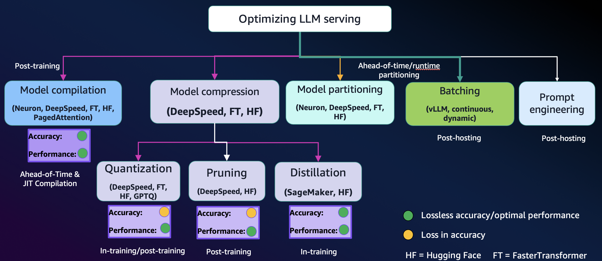
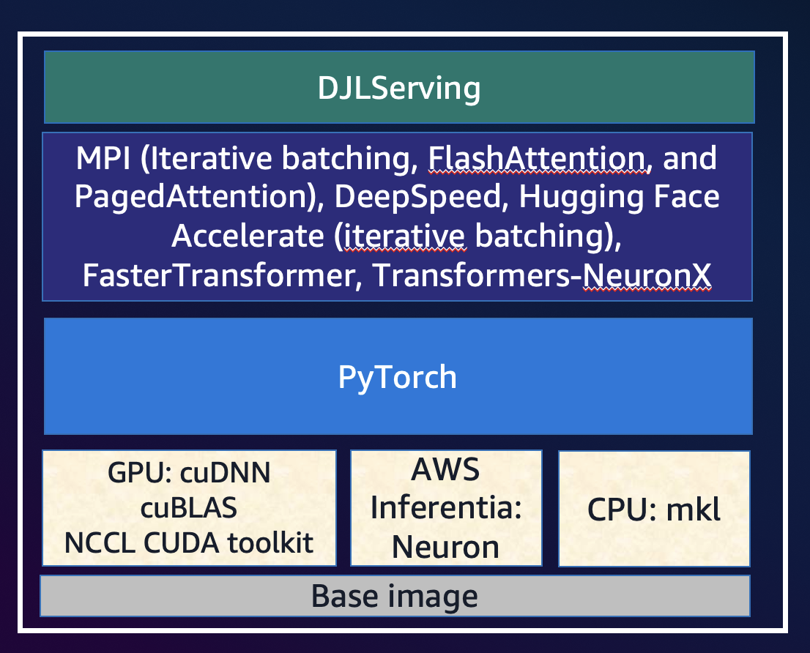
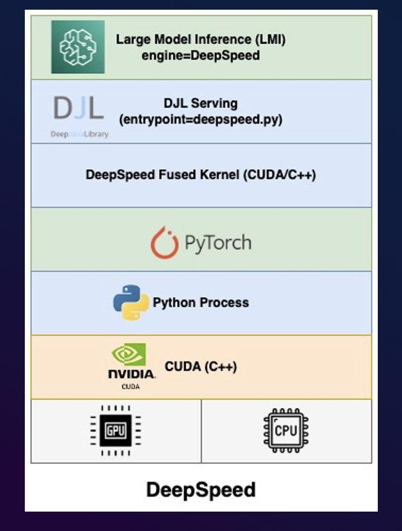

# Inference LLMs: Large Language Model in Operation

Latency and throughput have a complex relationship  [1]  that varies  significantly based on:

- model architecture, 
- serving configurations,  
- instance type hardware, 
- number of concurrent requests, 
- and variations in input payloads such as number of input tokens and output tokens.

Takaways from [1]:

- smaller models, such as Falcon 7B, don’t support model sharding
- larger models have higher compute resource requirements
- as sharding increases, performance typically improves, but may not necessarily improve for small models*.* -> 
  - small models such as 7B and 13B incur a substantial communication overhead when sharded across too many accelerators
- ml.p4d.24xlarge instances tend to have significantly better throughput  due to memory bandwidth improvements of A100 over A10G GPUs. 

## Optimizing LLMs

Picture from [2]

### Large Model Inference Container

|  |  |
| ------------------------------------------------------------ | ------------------------------------------------------------ |

Picture from [2]

## References:

- [1] Benchmark and optimize endpoint deployment in Amazon SageMaker JumpStart - https://aws.amazon.com/blogs/machine-learning/benchmark-and-optimize-endpoint-deployment-in-amazon-sagemaker-jumpstart/
- [2] BOA402 - Open source LLM optimization with Amazon SageMaker 