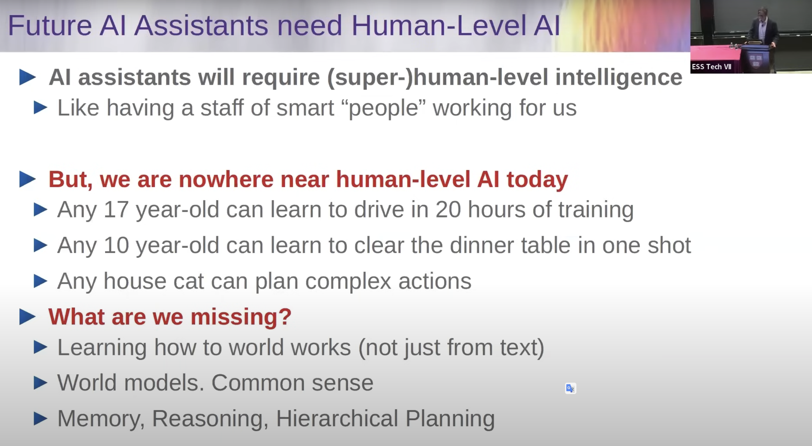
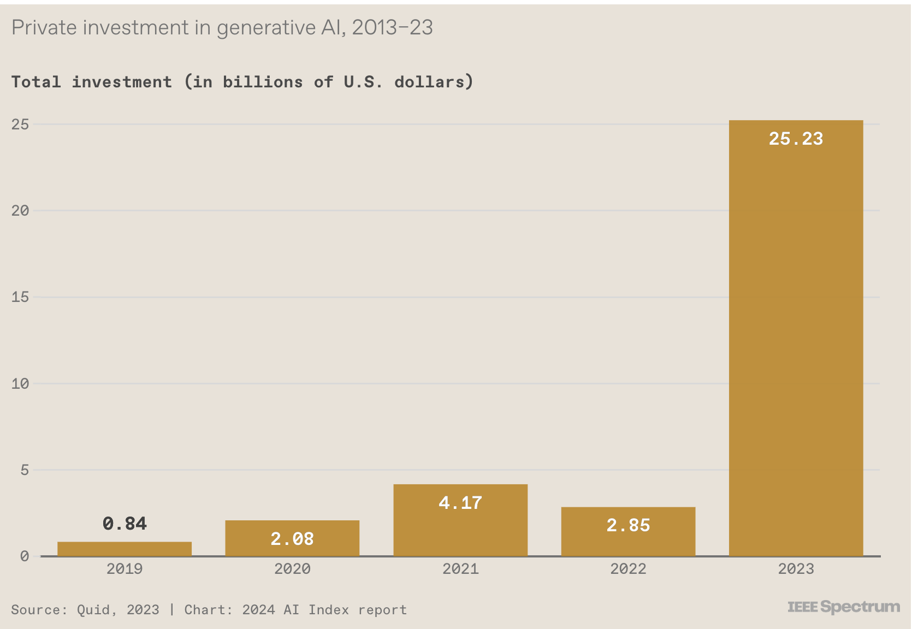

# Large Language Models

[TOC]

# Background

Ref. from Yann Leccun [video](https://www.youtube.com/watch?v=MiqLoAZFRSE&t=3983s)

Figure by [UbiquitousLearning/Efficient LLM and Foundation Models](UbiquitousLearning/Efficient LLM and Foundation Models)

Picture from:   Training Large  Foundation Models Using SageMaker HyperPod   by Ian Gibbs - Senior PMT-ES in AI/ML - Gen AI Enablement Weekly Series

### 1. Generative AI investment skyrockets

By IEEE Spectrum https://spectrum.ieee.org/ai-index-2024

# LLM Models

## Llama 3: 

- https://github.com/meta-llama/llama3
- https://github.com/meta-llama/llama-recipes
- https://github.com/amitsangani/Llama/blob/main/Building_Using_Llama.ipynb

# Prompt versus Fine Tune versus Pre-training

Guide to when to prompt versus fine tuning considering different organizations? 

## Parameter Efficient Fine Tuning

[PEFT](https://github.com/huggingface/peft), or Parameter  Efficient Fine-tuning, is  a Hugging Face open-source library to enable efficient adaptation of pre-trained language models (PLMs) to  various downstream applications without fine-tuning all the model's  parameters. PEFT currently includes techniques for:

- (Q)LoRA: [LORA: LOW-RANK ADAPTATION OF LARGE LANGUAGE MODELS](https://arxiv.org/pdf/2106.09685.pdf)

- Prefix Tuning: [P-Tuning v2: Prompt Tuning Can Be Comparable to Fine-tuning Universally Across Scales and Tasks](https://arxiv.org/pdf/2110.07602.pdf)

- P-Tuning: [GPT Understands, Too](https://arxiv.org/pdf/2103.10385.pdf)

- Prompt Tuning: [The Power of Scale for Parameter-Efficient Prompt Tuning](https://arxiv.org/pdf/2104.08691.pdf)

- IA3: [Infused Adapter by Inhibiting and Amplifying Inner Activations](https://arxiv.org/abs/2205.05638)

  

#### LoRA: Low-Rank Adaptation of LLMs

#### QLORA:

**Reference:**

[1] [LoRA Serving on Amazon SageMaker — Serve 100’s of Fine-Tuned LLMs For the Price of 1](https://medium.com/@joaopcmoura/lora-serving-on-amazon-sagemaker-serve-100s-of-fine-tuned-llms-for-the-price-of-1-85034ef889c5)

[2] [LoRA by HuggingFace](https://huggingface.co/docs/diffusers/main/en/training/lora)

[3] [Github example: Fine-tune LLaMA 2 on Amazon SageMaker](https://github.com/philschmid/sagemaker-huggingface-llama-2-samples/blob/master/training/sagemaker-notebook.ipynb)

[4] [GitHub example: Fine-tune LLaMA 2 models on SageMaker JumpStart](https://github.com/aws/amazon-sagemaker-examples/blob/main/introduction_to_amazon_algorithms/jumpstart-foundation-models/llama-2-finetuning.ipynb)

[5] [GitHub example: Fine-tune and deploy LLaMA V2 models on AWS Trainiumhttps://aws.amazon.com/ec2/instance-types/trn1/ and AWS Inferentiahttps://aws.amazon.com/ec2/instance-types/inf2/ based instances in SageMaker JumpStart](https://github.com/aws/amazon-sagemaker-examples/blob/main/introduction_to_amazon_algorithms/jumpstart-foundation-models/aws-trainium-inferentia-finetuning-deployment/llama-2-trainium-inferentia-finetuning-deployment.ipynb)

[6] [Ref.scaling down to scale up a guide to parameter-efficient fine-tuning](https://arxiv.org/abs/2303.15647)

[7] [LoRA Paper](https://arxiv.org/pdf/2106.09685.pdf)

[8] [LoRA Land: Fine-Tuned Open-Source LLMs that Outperform GPT-4](https://predibase.com/blog/lora-land-fine-tuned-open-source-llms-that-outperform-gpt-4)

# Price of Training LLMs

# License

Ref. [The Ultimate Battle of Language Models: Lit-LLaMA vs GPT3.5 vs Bloom vs …](https://lightning.ai/pages/community/community-discussions/the-ultimate-battle-of-language-models-lit-llama-vs-gpt3.5-vs-bloom-vs/)

### Commercial versus Licensed Models in HuggingFace

# RLHL: Reinforcement Learning Human in the Loop

### Policy

Proximal Policy Optimization ([PPO](https://openai.com/research/openai-baselines-ppo)):  reinforcement learing algorithm

### Deepracer PPO:

**Batch size:**

- number of experiences sampled at random from an experience buffer and used to update the neural network weights.

- The batch is a subset of an experience buffer that is composed of images captured by the camera mounted on the AWS DeepRacer vehicle and actions taken by the vehicle.

**Epochs**:

- Number of passes through the trainning data to update the NN weights during the gradient descent

**Learning rate:**

- controls how much gradient descent update contributes to the network weights. 

**Entropy:**

- Degree of uncertainty used to determine when to add randomness to the policy distribution.

**Discount Factor:**

- Determines how much of future rewards are discounted in calculating the reward at a given state as the average reward over all the future states. (0 -> current state is independent of future state, 1-> contribution from all future steps are included.)

**Loss type:**

- Objective function used to update the network weighs.
- Objective: from randon to strategic actiobs to increase the reward.

# Responsible AI

[Responsible Generative AI: A Code of Ethics for the Future](https://www.toptal.com/artificial-intelligence/future-of-generative-ai-ethics)

# References:

- [A Gentle Introduction to 8-bit Matrix Multiplication for transformers at scale using Hugging  Face Transformers, Accelerate and bitsandbytes](https://huggingface.co/blog/hf-bitsandbytes-integration) 
- [The Ultimate Battle of Language Models: Lit-LLaMA vs GPT3.5 vs Bloom vs …](https://lightning.ai/pages/community/community-discussions/the-ultimate-battle-of-language-models-lit-llama-vs-gpt3.5-vs-bloom-vs/)
- [SageMaker JumpStartModel API Docs](https://sagemaker.readthedocs.io/en/stable/api/inference/model.html#sagemaker.jumpstart.model.JumpStartModel)
- Video: [A Survey of Techniques for Maximizing LLM Performance, by OpenAI DevDay](https://www.youtube.com/watch?v=ahnGLM-RC1Y)
- [Mixture of Experts Explained, By HuggingFace](https://huggingface.co/blog/moe)
- Yann Lecun, New York University & META Title: Objective-Driven AI: Towards AI systems that can learn, remember, reason, and plan, [video](https://www.youtube.com/watch?v=MiqLoAZFRSE&t=3983s), [ppt](https://drive.google.com/file/d/1wzHohvoSgKGZvzOWqZybjm4M4veKR6t3/view?pli=1)
- IEEE Spectrum - 15 Graphs That Explain the State of AI in 2024  The AI Index tracks the generative AI boom, model costs, and responsible AI use https://spectrum.ieee.org/ai-index-2024 