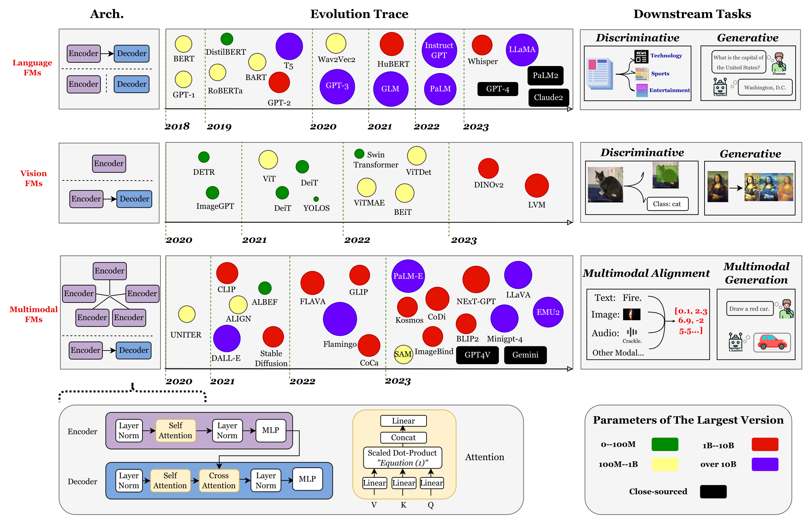
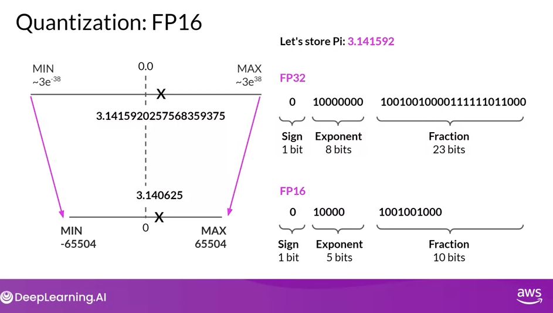

# Large Language Models

[TOC]

## Background



Figure by [UbiquitousLearning/Efficient LLM and Foundation Models](UbiquitousLearning/Efficient LLM and Foundation Models)


## Promp Engineering versus RAG versus Fine Tuning 


Prompt engineering example:


RAG versus Fine tuning


Example from OpenAI


Re-ranking: Apply across enconder or rule-based.

Classification step: having. the model to classify domain and give extra metadata on the prompt.

Tools: category of questions, e.g.. figures, acccess to SQL databases, etc..

Query expansion: List of question in prompt executed in paralell.

##### How to evaluate?

Picture below is based on [RAGAS -   *Evaluation framework for your Retrieval Augmented Generation (RAG) pipelines*](https://github.com/explodinggradients/ragas). Re. AWS-Bedrock example [here](https://github.com/explodinggradients/ragas/blob/132d5cd10fd9c0856543a4da43fc43c6d7b57ec4/docs/howtos/customisations/aws-bedrock.ipynb) and blog to ry [here](https://explodinggradients.com/evaluating-rag-pipelines-with-ragas-langsmith).


## Optimizing LLM Inference

Techniques such as quantization and distilation has been used to reduce model size.

For example the **[Int8](https://arxiv.org/abs/2208.07339)** inference can reduce memory footprint of large models by a factor of 2x.

### Precision Format

Size of the model is determined by the number of its parameters and their precision.

Based on IEEE standard for floating point arithmetics, it is common convention to represent numbers in binary using 64bits for **double-precision**, 32 bits for **single-precision** and 16 bits for **half-precision**.  In ML jargon FP32 is called full-precision (4 bytes) and FP16 are refered as half-precison (2 bytes).

For example, the float16 (FP16) data type, 5 bits are reserved for **exponent** (range) and 10 bits are reserved for **[mantissa](https://en.wikibooks.org/wiki/A-level_Computing/AQA/Paper_2/Fundamentals_of_data_representation/Floating_point_numbers)** (precision/fraction) and 1 bit for sign of the number. Compared to FP32, the FP36 has a much lower range exposing it to the risk of **overflowing** (i.e. trying to represent a number that is very large) and **underflowing** (i.e. trying to represent a number that is very small).


Example below from Coursera course: Generative AI with LLMs.




Nice to know: [Using the pi constant 3.14 E0](https://blogs.nvidia.com/blog/2019/11/15/whats-the-difference-between-single-double-multi-and-mixed-precision-computing/), the 3.14 is the precision and E0 the range Thus for FP16 we can have range of 2** 5 and precision of 2 **10.


#### Full and Half Precision in ML

Since FP32 is 2 times slower than FP16, a mixed precision approach is used in ML, where the weights are held in FP32 as a precise main weights reference and forward and backward pass are done for FP16/BF16 to enhance training speed. Thus the FP16 gradients are used to update the FP32 main weights.

**Calculating Model Size**

To calculate model size in bytes, you need to multiply the number of parameters by the size of the chosen precision in bytes. **E.g. using BF16 version of BLOOM-176B model we will need 176*E9 * 2 bytes = 352GBytes.**

Thus we need a few GPUs to do inference using Bloom-176B. But, luckily we can store the weights with less memory using different data types --> technique called **quantization**. Two common 8-bit quantizations techniques are **zero-pointy quantization** and **absolute maximum**  (absmax) quantization.


#### Model Quantization

8-bit quantization method used a quarter precision, then reducing the model to 1/4th of its original size. Quantization is done by "rounding" from one data type to another. However this might lead to information loss (i.e. lossy compression)


LLM.int8() is an example of quantization implemented by HuggingFace Transformers. To achieve zero degradation matrix multiplication for LLM, LLM.int8() remove the performance deterioration caused by outlier features by identifying the outliers from the input hidden states and multiplying it in FP16 and non-outliers in int8.


A side effect of this quantization is the the model can suffer performance degradtion (15% to 23% slower than the FP16)


#### Memory Usage

Falcon Models


| Model                      | Layers | d_model | Head_dim | Vocabulary | Sequence length | Hardware                  | GPU Memory required                         | Pretraining length [tokens] | Pretraining compute [PF-days] | K,V-cache size for a 2.048 context |
| -------------------------- | ------ | ------- | -------- | ---------- | --------------- | ------------------------- | ------------------------------------------- | --------------------------- | ----------------------------- | ---------------------------------- |
| tiiuae/falcon-40b-instruct | 60     | 8192    | 64       | 65024      | 2048            | 64 A100 40GB in p4d.      | [~90GB](https://huggingface.co/blog/falcon) | 1.0 Trillion                | 2800                          | 20MB                               |
| tiiuae/falcon-7b-instruct  | 32     | 4544    | 64       | 65024      | 2048            | 32 A100 40GB GPUs in P4d. | [~15GB](https://huggingface.co/blog/falcon) | 1.5 Trillion                | 700                           | 240MB                              |


AWS Instances:

| Instance    | Memory | vCPUs   | GPUs | GPU Memory | GPU Model   | Storage         | Price           |
| ----------- | ------ | ------- | ---- | ---------- | ----------- | --------------- | --------------- |
| g5.12xlarge | 192GB  | 48vCPU  | 4    | 96GiB      | NVIDIA A10G | 3800GB NVMe SSD | $6.3317 hourly  |
| g5.48xlarge | 768GB  | 192vCPU | 8    | 192GiB     | NVIDIA A10G | 7600GB          | $18.1823 hourly |
|             |        |         |      |            |             |                 |                 |


Error example while trying to run Falcon 40B on g5.12xlarge.


Error while trying to run Falcon 40B on g5.48xlarge

```bash
---------------------------------------------------------------------------
ModelError                                Traceback (most recent call last)
File <timed exec>:13

File /opt/conda/lib/python3.10/site-packages/sagemaker/base_predictor.py:167, in Predictor.predict(self, data, initial_args, target_model, target_variant, inference_id)
    137 """Return the inference from the specified endpoint.
    138 
    139 Args:
   (...)
    161         as is.
    162 """
    164 request_args = self._create_request_args(
    165     data, initial_args, target_model, target_variant, inference_id
    166 )
--> 167 response = self.sagemaker_session.sagemaker_runtime_client.invoke_endpoint(**request_args)
    168 return self._handle_response(response)

File /opt/conda/lib/python3.10/site-packages/botocore/client.py:530, in ClientCreator._create_api_method.<locals>._api_call(self, *args, **kwargs)
    526     raise TypeError(
    527         f"{py_operation_name}() only accepts keyword arguments."
    528     )
    529 # The "self" in this scope is referring to the BaseClient.
--> 530 return self._make_api_call(operation_name, kwargs)

File /opt/conda/lib/python3.10/site-packages/botocore/client.py:964, in BaseClient._make_api_call(self, operation_name, api_params)
    962     error_code = parsed_response.get("Error", {}).get("Code")
    963     error_class = self.exceptions.from_code(error_code)
--> 964     raise error_class(parsed_response, operation_name)
    965 else:
    966     return parsed_response

ModelError: An error occurred (ModelError) when calling the InvokeEndpoint operation: Received server error (0) from primary with message "Your invocation timed out while waiting for a response from container primary. Review the latency metrics for each container in Amazon CloudWatch, resolve the issue, and try again.". See https://eu-west-1.console.aws.amazon.com/cloudwatch/home?region=eu-west-1#logEventViewer:group=/aws/sagemaker/Endpoints/falcon-40b-instruct-bf16-2023-06-13-08-05-40-744 in account 754992829378 for more information.
​
```


# Price of Training LLMs


# License


Ref. [The Ultimate Battle of Language Models: Lit-LLaMA vs GPT3.5 vs Bloom vs …](https://lightning.ai/pages/community/community-discussions/the-ultimate-battle-of-language-models-lit-llama-vs-gpt3.5-vs-bloom-vs/)


### Commercial versus Licensed Models in HuggingFace


# Prompt versus Fine Tune versus Pre-training

Guide to when to prompt versus fine tuning considering different organizations? 


# Parameter Efficient Fine Tuning Methods:

[Ref.scaling down to scale up a guide to parameter-efficient fine-tuning](https://arxiv.org/abs/2303.15647)

#### LoRA: Low-Rank Adaptation of LLMs


Reference:

[1] [LoRA Serving on Amazon SageMaker — Serve 100’s of Fine-Tuned LLMs For the Price of 1](https://medium.com/@joaopcmoura/lora-serving-on-amazon-sagemaker-serve-100s-of-fine-tuned-llms-for-the-price-of-1-85034ef889c5)


# RLHL: Reinforcement Learning Human in the Loop

### Policy

Proximal Policy Optimization ([PPO](https://openai.com/research/openai-baselines-ppo)):  reinforcement learing algorithm


### Deepracer PPO:

**Batch size:**

- number of experiences sampled at random from an experience buffer and used to update the neural network weights.

- The batch is a subset of an experience buffer that is composed of images captured by the camera mounted on the AWS DeepRacer vehicle and actions taken by the vehicle.

**Epochs**:

- Number of passes through the trainning data to update the NN weights during the gradient descent

**Learning rate:**

- controls how much gradient descent update contributes to the network weights. 

**Entropy:**

- Degree of uncertainty used to determine when to add randomness to the policy distribution.

**Discount Factor:**

- Determines how much of future rewards are discounted in calculating the reward at a given state as the average reward over all the future states. (0 -> current state is independent of future state, 1-> contribution from all future steps are included.)

**Loss type:**

- Objective function used to update the network weighs.
- Objective: from randon to strategic actiobs to increase the reward.


## Responsible AI

[Responsible Generative AI: A Code of Ethics for the Future](https://www.toptal.com/artificial-intelligence/future-of-generative-ai-ethics)


# References:

- [A Gentle Introduction to 8-bit Matrix Multiplication for transformers at scale using Hugging  Face Transformers, Accelerate and bitsandbytes](https://huggingface.co/blog/hf-bitsandbytes-integration) 
- [The Ultimate Battle of Language Models: Lit-LLaMA vs GPT3.5 vs Bloom vs …](https://lightning.ai/pages/community/community-discussions/the-ultimate-battle-of-language-models-lit-llama-vs-gpt3.5-vs-bloom-vs/)
- [SageMaker JumpStartModel API Docs](https://sagemaker.readthedocs.io/en/stable/api/inference/model.html#sagemaker.jumpstart.model.JumpStartModel)
- Video: [A Survey of Techniques for Maximizing LLM Performance, by OpenAI DevDay](https://www.youtube.com/watch?v=ahnGLM-RC1Y)