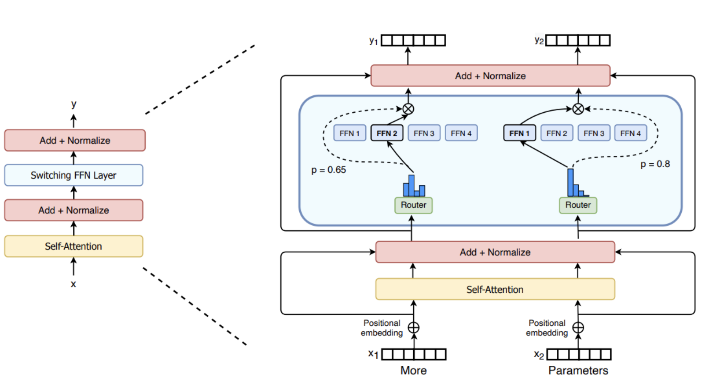

# Large Language Models

[TOC]

# Background

Figure by [UbiquitousLearning/Efficient LLM and Foundation Models](UbiquitousLearning/Efficient LLM and Foundation Models)

Picture from:   Training Large  Foundation Models Using SageMaker HyperPod   by Ian Gibbs - Senior PMT-ES in AI/ML - Gen AI Enablement Weekly Series

# Prompt versus Fine Tune versus Pre-training

Guide to when to prompt versus fine tuning considering different organizations? 

# 

# Optimizing LLM Inference

Techniques such as quantization and distilation has been used to reduce model size.

For example the **[Int8](https://arxiv.org/abs/2208.07339)** inference can reduce memory footprint of large models by a factor of 2x.

## Quantization

### Precision Format

Size of the model is determined by the number of its parameters and their precision.

Based on IEEE standard for floating point arithmetics, it is common convention to represent numbers in binary using 64bits for **double-precision**, 32 bits for **single-precision** and 16 bits for **half-precision**.  In ML jargon FP32 is called full-precision (4 bytes) and FP16 are refered as half-precison (2 bytes).

For example, the float16 (FP16) data type, 5 bits are reserved for **exponent** (range) and 10 bits are reserved for **[mantissa](https://en.wikibooks.org/wiki/A-level_Computing/AQA/Paper_2/Fundamentals_of_data_representation/Floating_point_numbers)** (precision/fraction) and 1 bit for sign of the number. Compared to FP32, the FP36 has a much lower range exposing it to the risk of **overflowing** (i.e. trying to represent a number that is very large) and **underflowing** (i.e. trying to represent a number that is very small).

Example below from Coursera course: Generative AI with LLMs.

Nice to know: [Using the pi constant 3.14 E0](https://blogs.nvidia.com/blog/2019/11/15/whats-the-difference-between-single-double-multi-and-mixed-precision-computing/), the 3.14 is the precision and E0 the range Thus for FP16 we can have range of 2** 5 and precision of 2 **10.

#### Full and Half Precision in ML

Since FP32 is 2 times slower than FP16, a mixed precision approach is used in ML, where the weights are held in FP32 as a precise main weights reference and forward and backward pass are done for FP16/BF16 to enhance training speed. Thus the FP16 gradients are used to update the FP32 main weights.

**Calculating Model Size**

To calculate model size in bytes, you need to multiply the number of parameters by the size of the chosen precision in bytes. **E.g. using BF16 version of BLOOM-176B model we will need 176*E9 * 2 bytes = 352GBytes.**

Thus we need a few GPUs to do inference using Bloom-176B. But, luckily we can store the weights with less memory using different data types --> technique called **quantization**. Two common 8-bit quantizations techniques are **zero-pointy quantization** and **absolute maximum**  (absmax) quantization.

#### Model Quantization

8-bit quantization method used a quarter precision, then reducing the model to 1/4th of its original size. Quantization is done by "rounding" from one data type to another. However this might lead to information loss (i.e. lossy compression)

LLM.int8() is an example of quantization implemented by HuggingFace Transformers. To achieve zero degradation matrix multiplication for LLM, LLM.int8() remove the performance deterioration caused by outlier features by identifying the outliers from the input hidden states and multiplying it in FP16 and non-outliers in int8.

A side effect of this quantization is the the model can suffer performance degradtion (15% to 23% slower than the FP16)

#### Memory Usage

Falcon Models

| Model                      | Layers | d_model | Head_dim | Vocabulary | Sequence length | Hardware                  | GPU Memory required                         | Pretraining length [tokens] | Pretraining compute [PF-days] | K,V-cache size for a 2.048 context |
| -------------------------- | ------ | ------- | -------- | ---------- | --------------- | ------------------------- | ------------------------------------------- | --------------------------- | ----------------------------- | ---------------------------------- |
| tiiuae/falcon-40b-instruct | 60     | 8192    | 64       | 65024      | 2048            | 64 A100 40GB in p4d.      | [~90GB](https://huggingface.co/blog/falcon) | 1.0 Trillion                | 2800                          | 20MB                               |
| tiiuae/falcon-7b-instruct  | 32     | 4544    | 64       | 65024      | 2048            | 32 A100 40GB GPUs in P4d. | [~15GB](https://huggingface.co/blog/falcon) | 1.5 Trillion                | 700                           | 240MB                              |

AWS Instances:

| Instance    | Memory | vCPUs   | GPUs | GPU Memory | GPU Model   | Storage         | Price           |
| ----------- | ------ | ------- | ---- | ---------- | ----------- | --------------- | --------------- |
| g5.12xlarge | 192GB  | 48vCPU  | 4    | 96GiB      | NVIDIA A10G | 3800GB NVMe SSD | $6.3317 hourly  |
| g5.48xlarge | 768GB  | 192vCPU | 8    | 192GiB     | NVIDIA A10G | 7600GB          | $18.1823 hourly |
|             |        |         |      |            |             |                 |                 |

**Reference:**

- [Quantization by HuggingFace](https://huggingface.co/docs/transformers/quantization?bnb=4-bit)

## Parameter Efficient Fine Tuning

[PEFT](https://github.com/huggingface/peft), or Parameter  Efficient Fine-tuning, is  a Hugging Face open-source library to enable efficient adaptation of pre-trained language models (PLMs) to  various downstream applications without fine-tuning all the model's  parameters. PEFT currently includes techniques for:

- (Q)LoRA: [LORA: LOW-RANK ADAPTATION OF LARGE LANGUAGE MODELS](https://arxiv.org/pdf/2106.09685.pdf)

- Prefix Tuning: [P-Tuning v2: Prompt Tuning Can Be Comparable to Fine-tuning Universally Across Scales and Tasks](https://arxiv.org/pdf/2110.07602.pdf)

- P-Tuning: [GPT Understands, Too](https://arxiv.org/pdf/2103.10385.pdf)

- Prompt Tuning: [The Power of Scale for Parameter-Efficient Prompt Tuning](https://arxiv.org/pdf/2104.08691.pdf)

- IA3: [Infused Adapter by Inhibiting and Amplifying Inner Activations](https://arxiv.org/abs/2205.05638)

  

#### LoRA: Low-Rank Adaptation of LLMs

#### QLORA:

**Reference:**

[1] [LoRA Serving on Amazon SageMaker — Serve 100’s of Fine-Tuned LLMs For the Price of 1](https://medium.com/@joaopcmoura/lora-serving-on-amazon-sagemaker-serve-100s-of-fine-tuned-llms-for-the-price-of-1-85034ef889c5)

[2] [LoRA by HuggingFace](https://huggingface.co/docs/diffusers/main/en/training/lora)

[3] [Github example: Fine-tune LLaMA 2 on Amazon SageMaker](https://github.com/philschmid/sagemaker-huggingface-llama-2-samples/blob/master/training/sagemaker-notebook.ipynb)

[4] [GitHub example: Fine-tune LLaMA 2 models on SageMaker JumpStart](https://github.com/aws/amazon-sagemaker-examples/blob/main/introduction_to_amazon_algorithms/jumpstart-foundation-models/llama-2-finetuning.ipynb)

[5] [GitHub example: Fine-tune and deploy LLaMA V2 models on AWS Trainiumhttps://aws.amazon.com/ec2/instance-types/trn1/ and AWS Inferentiahttps://aws.amazon.com/ec2/instance-types/inf2/ based instances in SageMaker JumpStart](https://github.com/aws/amazon-sagemaker-examples/blob/main/introduction_to_amazon_algorithms/jumpstart-foundation-models/aws-trainium-inferentia-finetuning-deployment/llama-2-trainium-inferentia-finetuning-deployment.ipynb)

[6] [Ref.scaling down to scale up a guide to parameter-efficient fine-tuning](https://arxiv.org/abs/2303.15647)

[7] [LoRA Paper](https://arxiv.org/pdf/2106.09685.pdf)

[8] [LoRA Land: Fine-Tuned Open-Source LLMs that Outperform GPT-4](https://predibase.com/blog/lora-land-fine-tuned-open-source-llms-that-outperform-gpt-4)

# Price of Training LLMs

# License

Ref. [The Ultimate Battle of Language Models: Lit-LLaMA vs GPT3.5 vs Bloom vs …](https://lightning.ai/pages/community/community-discussions/the-ultimate-battle-of-language-models-lit-llama-vs-gpt3.5-vs-bloom-vs/)

### Commercial versus Licensed Models in HuggingFace

# RLHL: Reinforcement Learning Human in the Loop

### Policy

Proximal Policy Optimization ([PPO](https://openai.com/research/openai-baselines-ppo)):  reinforcement learing algorithm

### Deepracer PPO:

**Batch size:**

- number of experiences sampled at random from an experience buffer and used to update the neural network weights.

- The batch is a subset of an experience buffer that is composed of images captured by the camera mounted on the AWS DeepRacer vehicle and actions taken by the vehicle.

**Epochs**:

- Number of passes through the trainning data to update the NN weights during the gradient descent

**Learning rate:**

- controls how much gradient descent update contributes to the network weights. 

**Entropy:**

- Degree of uncertainty used to determine when to add randomness to the policy distribution.

**Discount Factor:**

- Determines how much of future rewards are discounted in calculating the reward at a given state as the average reward over all the future states. (0 -> current state is independent of future state, 1-> contribution from all future steps are included.)

**Loss type:**

- Objective function used to update the network weighs.
- Objective: from randon to strategic actiobs to increase the reward.

# Responsible AI

[Responsible Generative AI: A Code of Ethics for the Future](https://www.toptal.com/artificial-intelligence/future-of-generative-ai-ethics)

# Mixture of Experts (MoE)

**Key facts:**

- pretained much faster compared to dense modelsas it allows scale up the model or dataset size with the same compute budget
- Faster inference if compared with other models with same number of parameters. Despite have many parameters, MoE onlt use some of them during inference.
- High VRAM required to load all experts in memory
- Challenges in fine-tuning 

## **What is MoE**

### Sparse MoE layers

Used instead of dense feed-forward network (FFN) layers.

Layers has a certain number of **experts**, where each expert is a neural network. Each expert is an FFN, but can be more complex networks as well.

### Router of Gateway Network

Determines which token are sent to which expert. Tokens can be sent to more tgan one expert.

Router is composed by learned parameters and is pretrained at the same time as the rest of the network.

Source reference: MoE layer from the [Switch Transformers paper](https://arxiv.org/abs/2101.03961)

The router needs to decide which expert (E) to send a part of the input (token).

A tipical gating function for the router G is a simple softmax function. Thus router (a.k.a. network) will learb which expert to send the input to.

Top-k gating is used with introducing of noise. Inference can run much faster if using a low enought top-K (one or two) comprared to using many experts. However, the selection of a single top expert is needed to have the router learn  how to route to different experts.

According to [MoE blog by HuggingFace](https://huggingface.co/blog/moe) noise is needed for load balancing purpose. The noise would avoid the router to only select the same few experts during training (avoid self-reinforce favored experts during training). Thus the noise (a.k.a. auxiliary loss) gives all experts equal importance.

In `transformers`, the auxiliary loss is exposed via the `aux_loss` parameter. 

Switch Transformer used a simplified strategy os selecting a single-expert. This introduces the following benefits:

- The router computation is reduced
- The batch size of each expert can be at least halved
- Communication costs are reduced
- Quality is preserved

##### Additional Strategies:

- Use bfloat16 while training the experts and full precision for the rest of the computations. This reduces communication cost between processors, computation costs and reduce memory or storing tensors.
- 

### MoE Challenges

- Fine-tuning: struggle to generalize during fine-tuning leading to overfitting
- Inference: Despite using only some parameters during inference, MoE needs to load all parameters into RAM leading to higher memory requirements. 
- Example:Mixtral 8x7B = 56B RAM needed. But for inference speed is like using 12B model (oposed to a 14B model) since it computes 2x7B matrix multiplication but with some layers shared.

# References:

- [A Gentle Introduction to 8-bit Matrix Multiplication for transformers at scale using Hugging  Face Transformers, Accelerate and bitsandbytes](https://huggingface.co/blog/hf-bitsandbytes-integration) 
- [The Ultimate Battle of Language Models: Lit-LLaMA vs GPT3.5 vs Bloom vs …](https://lightning.ai/pages/community/community-discussions/the-ultimate-battle-of-language-models-lit-llama-vs-gpt3.5-vs-bloom-vs/)
- [SageMaker JumpStartModel API Docs](https://sagemaker.readthedocs.io/en/stable/api/inference/model.html#sagemaker.jumpstart.model.JumpStartModel)
- Video: [A Survey of Techniques for Maximizing LLM Performance, by OpenAI DevDay](https://www.youtube.com/watch?v=ahnGLM-RC1Y)
- [Mixture of Experts Explained, By HuggingFace](https://huggingface.co/blog/moe)