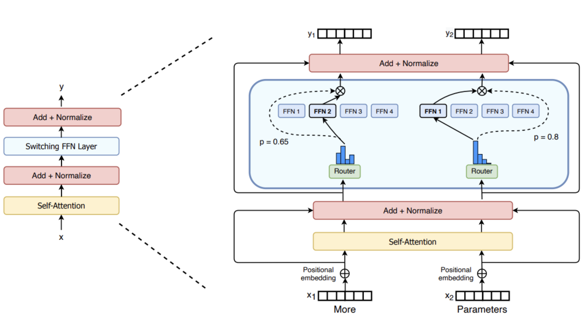
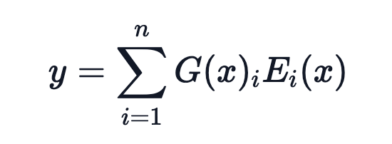
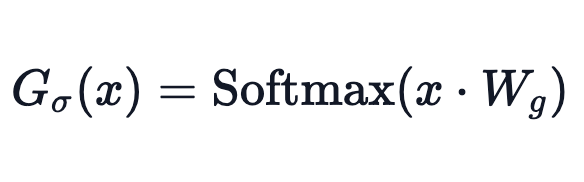

# Mixture of Experts (MoE)

[TOC]

## **Key facts:**

- pretained much faster compared to dense modelsas it allows scale up the model or dataset size with the same compute budget
- Faster inference if compared with other models with same number of parameters. Despite have many parameters, MoE onlt use some of them during inference.
- High VRAM required to load all experts in memory
- Challenges in fine-tuning 

## **What is MoE**

### Sparse MoE layers

Used instead of dense feed-forward network (FFN) layers.

Layers has a certain number of **experts**, where each expert is a neural network. Each expert is an FFN, but can be more complex networks as well.

### Router of Gateway Network

Determines which token are sent to which expert. Tokens can be sent to more tgan one expert.

Router is composed by learned parameters and is pretrained at the same time as the rest of the network.

Source reference: MoE layer from the [Switch Transformers paper](https://arxiv.org/abs/2101.03961)

The router needs to decide which expert (E) to send a part of the input (token).

A tipical gating function for the router G is a simple softmax function. Thus router (a.k.a. network) will learb which expert to send the input to.

Top-k gating is used with introducing of noise. Inference can run much faster if using a low enought top-K (one or two) comprared to using many experts. However, the selection of a single top expert is needed to have the router learn  how to route to different experts.

According to [MoE blog by HuggingFace](https://huggingface.co/blog/moe) noise is needed for load balancing purpose. The noise would avoid the router to only select the same few experts during training (avoid self-reinforce favored experts during training). Thus the noise (a.k.a. auxiliary loss) gives all experts equal importance.

In `transformers`, the auxiliary loss is exposed via the `aux_loss` parameter. 

Switch Transformer used a simplified strategy os selecting a single-expert. This introduces the following benefits:

- The router computation is reduced
- The batch size of each expert can be at least halved
- Communication costs are reduced
- Quality is preserved

##### Additional Strategies:

- Use bfloat16 while training the experts and full precision for the rest of the computations. This reduces communication cost between processors, computation costs and reduce memory or storing tensors.
- 

### MoE Challenges

- Fine-tuning: struggle to generalize during fine-tuning leading to overfitting
- Inference: Despite using only some parameters during inference, MoE needs to load all parameters into RAM leading to higher memory requirements. 
- Example:Mixtral 8x7B = 56B RAM needed. But for inference speed is like using 12B model (oposed to a 14B model) since it computes 2x7B matrix multiplication but with some layers shared.

# MoE Fine-Tuning

Large language models are expensived to be trained. Fine-tuning is an affordable way to take advantage of LLMs while customizing a model on a smaller dataset.

Thus fine-tuning is a customization method that involves further traininig the model. According to [[Fine-tune a foundation model](https://docs.aws.amazon.com/sagemaker/latest/dg/jumpstart-foundation-models-fine-tuning.html)], fine-tuning might be applicable for the following usecases:

- customize model to business needs (e.g. function calling)
- adapt the model to a domain-specific language such as technical terms and specialized vocabs.
- enhance the performance for specific tasks
- More factual, less toxic and better aligned responses

There are currently two approaches for fine-tuning models:

- domain adaptation fine-tuning
- Instruction-based fine-tuning

**Domain adaptation:**

Used in order to adapt a pre-trained model to **a specific task(s)**. The training dataset is unstructured (no instruction based).

Examples of domain adaptation for Llama2 and Mistral using Amazon SageMaker can be find at [Fine-tune LLaMA 2 models on SageMaker JumpStart](https://sagemaker-examples.readthedocs.io/en/latest/introduction_to_amazon_algorithms/jumpstart-foundation-models/llama-2-finetuning.html#Fine-tune-LLaMA-2-models-on-SageMaker-JumpStart)  and [Mistral  Domain adaptation fine-tuning](https://github.com/aws/amazon-sagemaker-examples/blob/main/introduction_to_amazon_algorithms/jumpstart-foundation-models/mistral-7b-instruction-domain-adaptation-finetuning.ipynb).

**Instruction-based fine-tuning**

Instruction-based fine-tuning used labeled data to improve performance of pre-trained model on specific tasks. Labeled data is formaed as prompt and response pairs.

Examples of instruction-based fine tuning is [Fine-tune LLaMA 2 models on SageMaker JumpStart](https://sagemaker-examples.readthedocs.io/en/latest/introduction_to_amazon_algorithms/jumpstart-foundation-models/llama-2-finetuning.html#Fine-tune-LLaMA-2-models-on-SageMaker-JumpStart)

# References:

- Video: [A Survey of Techniques for Maximizing LLM Performance, by OpenAI DevDay](https://www.youtube.com/watch?v=ahnGLM-RC1Y)

- [Mixture of Experts Explained, By HuggingFace](https://huggingface.co/blog/moe)

- [Mistral-finetune by Mistral AI](https://github.com/mistralai/mistral-finetune)

- [Fine Tuning with Function Calling on Azure OpenAI Service by Microsoft](https://techcommunity.microsoft.com/t5/ai-azure-ai-services-blog/fine-tuning-with-function-calling-on-azure-openai-service/ba-p/4065968)

- [Fine-tuning with function calling - stock price use case by Azure](https://github.com/Azure-Samples/azureai-samples/tree/main/scenarios/fine-tuning/function%20calling)

- [Fine-tune and Deploy Mistral 7B with Amazon SageMaker JumpStart](https://aws.amazon.com/blogs/machine-learning/fine-tune-and-deploy-mistral-7b-with-amazon-sagemaker-jumpstart/) 

- [Introduction to SageMaker JumpStart - Text Generation with Mistral models](https://github.com/aws/amazon-sagemaker-examples/blob/main/introduction_to_amazon_algorithms/jumpstart-foundation-models/mistral-7b-instruction-domain-adaptation-finetuning.ipynb)

- [Fine Tuning with Function Calling by LlamaIndex](https://docs.llamaindex.ai/en/stable/examples/finetuning/openai_fine_tuning_functions/#fine-tuning-with-function-calling)

  

