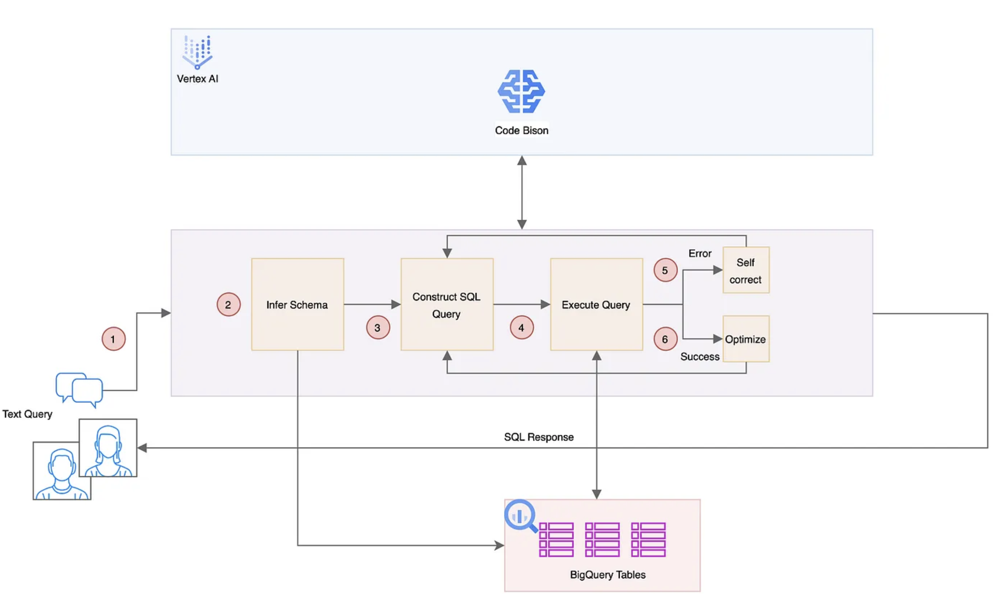

# Retrieval Augumented Generation


## Text-to-SQL

### **Pattern: [Direct Schema Inference, Self-Correction & Optimization](https://github.com/arunpshankar/LLM-Text-to-SQL-Architectures/blob/main/05-Pattern-V/01-self-correct-rank-by-latency-chat.ipynb)**

**Direct schema inference:** ‘*seed prompt*’ that instructs the LLM to construct an SQL query corresponding to a user’s inquiry.The execution of this initial prompt continues iteratively until it meets with success.

```sql
Please craft a SQL query for BigQuery that addresses the following QUESTION provided below. 
Ensure you reference the appropriate BigQuery tables and column names provided in the SCHEMA below. 
When joining tables, employ type coercion to guarantee data type consistency for the join columns. 
Additionally, the output column names should specify units where applicable.\n
QUESTION:
{}\n
SCHEMA:
{}\n
IMPORTANT: 
Use ONLY DATETIME and DO NOT use TIMESTAMP.
--
Ensure your SQL query accurately defines both the start and end of the DATETIME range.
```

**Self-correction**:f ailures are treated as critical learning opportunity for the LLM,  allowing it to scrutinize tracebacks and utilize error messages to  refine and evolve the seed prompt into an improved query iteration.

```sql
prompt = f"""Encountered an error: {msg}. 
To address this, please generate an alternative SQL query response that avoids this specific error. 
Follow the instructions mentioned above to remediate the error. 

Modify the below SQL query to resolve the issue:
{generated_sql_query}

Ensure the revised SQL query aligns precisely with the requirements outlined in the initial question."""
```

**Optimization**:




## Dealing with Hallucination

> Reducing hallucination:
>
> a. Prompt Engineering: Your prompt is quite explicit, but you may  want to make it even more stringent. You could add sentences that  explicitly ask the model not to extrapolate from the data. What  temperature are you using?
>
> b. Confidence Scoring: Implement a confidence score mechanism to  assess the relevance of the generated response to the query and the  provided content. If the score is below a certain threshold, default to  “Sorry, I am unable to answer your query.”
>
> c. Post-processing: After the model generates an answer, you could  add another layer of validation to verify the factual accuracy of the  response against the data before sending it to the user.
>
> d. User Feedback Loop: Allow users to flag incorrect answers, which  could be used to fine-tune the model or adjust its confidence  thresholds.
>
> From: [Hallucination in retrieval augmented chatbot (RAG)](https://community.openai.com/t/hallucination-in-retrieval-augmented-chatbot-rag/408275)


## References:

- [Architectural Patterns for Text-to-SQL: Leveraging LLMs for Enhanced BigQuery Interactions](https://medium.com/google-cloud/architectural-patterns-for-text-to-sql-leveraging-llms-for-enhanced-bigquery-interactions-59756a749e15)
- [12 RAG Pain Points and Proposed Solutions](https://towardsdatascience.com/12-rag-pain-points-and-proposed-solutions-43709939a28c)