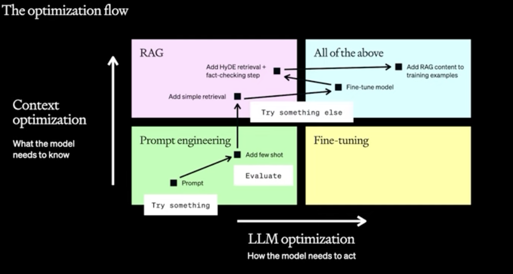
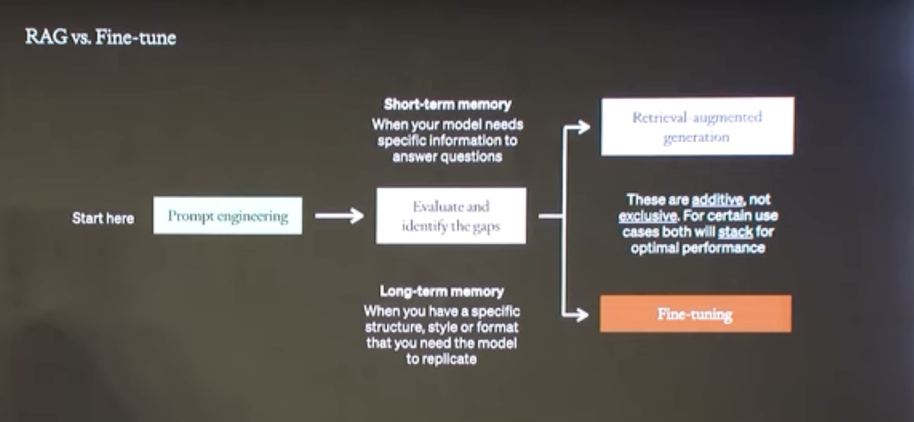
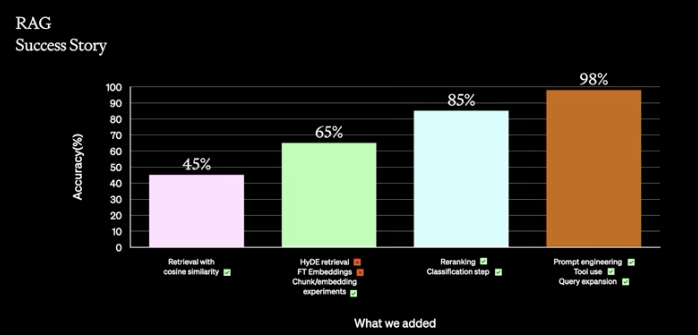

# Retrieval Augmented Generation

### 

### Criteria to choose right Vector Database

Choosing the right database can be difficult as it will depend on the specific application requirements.

Commonly used aspects that you need to consider are:

- **Feature requirement**: any special search feature needed like hybrid search, multi-vector support, BM25, etc.
-  **Technical requirement**: any performance needs in terms of low latency, index sharding, reindexing, scalability, multi-tenancy or local deployment.
- **Operation & Cost Requirements**: are licensing, cost, community support and enterprise options needed

[Here](https://superlinked.com/vector-db-comparison) you find and example of Vector database comparison done by [Dhruv Anand](https://www.linkedin.com/in/dhruv-anand-ainorthstartech/).


## Promp Engineering versus RAG versus Fine Tuning 




Prompt engineering example:


RAG versus Fine tuning



Example from OpenAI



Re-ranking: Apply across enconder or rule-based.

Classification step: having. the model to classify domain and give extra metadata on the prompt.

Tools: category of questions, e.g.. figures, acccess to SQL databases, etc..

Query expansion: List of question in prompt executed in paralell.

##### How to evaluate?

Picture below is based on [RAGAS -   *Evaluation framework for your Retrieval Augmented Generation (RAG) pipelines*](https://github.com/explodinggradients/ragas). Re. AWS-Bedrock example [here](https://github.com/explodinggradients/ragas/blob/132d5cd10fd9c0856543a4da43fc43c6d7b57ec4/docs/howtos/customisations/aws-bedrock.ipynb) and blog to ry [here](https://explodinggradients.com/evaluating-rag-pipelines-with-ragas-langsmith).


## Techniques

### Text-to-SQL

### **Pattern: [Direct Schema Inference, Self-Correction & Optimization](https://github.com/arunpshankar/LLM-Text-to-SQL-Architectures/blob/main/05-Pattern-V/01-self-correct-rank-by-latency-chat.ipynb)**

**Direct schema inference:** ‘*seed prompt*’ that instructs the LLM to construct an SQL query corresponding to a user’s inquiry.The execution of this initial prompt continues iteratively until it meets with success.

```sql
Please craft a SQL query for BigQuery that addresses the following QUESTION provided below. 
Ensure you reference the appropriate BigQuery tables and column names provided in the SCHEMA below. 
When joining tables, employ type coercion to guarantee data type consistency for the join columns. 
Additionally, the output column names should specify units where applicable.\n
QUESTION:
{}\n
SCHEMA:
{}\n
IMPORTANT: 
Use ONLY DATETIME and DO NOT use TIMESTAMP.
--
Ensure your SQL query accurately defines both the start and end of the DATETIME range.
```

**Self-correction**:f ailures are treated as critical learning opportunity for the LLM,  allowing it to scrutinize tracebacks and utilize error messages to  refine and evolve the seed prompt into an improved query iteration.

```sql
prompt = f"""Encountered an error: {msg}. 
To address this, please generate an alternative SQL query response that avoids this specific error. 
Follow the instructions mentioned above to remediate the error. 

Modify the below SQL query to resolve the issue:
{generated_sql_query}

Ensure the revised SQL query aligns precisely with the requirements outlined in the initial question."""
```

**Optimization**:


## Dealing with Hallucination

> Reducing hallucination:
>
> a. Prompt Engineering: Your prompt is quite explicit, but you may  want to make it even more stringent. You could add sentences that  explicitly ask the model not to extrapolate from the data. What  temperature are you using?
>
> b. Confidence Scoring: Implement a confidence score mechanism to  assess the relevance of the generated response to the query and the  provided content. If the score is below a certain threshold, default to  “Sorry, I am unable to answer your query.”
>
> c. Post-processing: After the model generates an answer, you could  add another layer of validation to verify the factual accuracy of the  response against the data before sending it to the user.
>
> d. User Feedback Loop: Allow users to flag incorrect answers, which  could be used to fine-tune the model or adjust its confidence  thresholds.
>
> From: [Hallucination in retrieval augmented chatbot (RAG)](https://community.openai.com/t/hallucination-in-retrieval-augmented-chatbot-rag/408275)


# Advanced RAG Techniques:

Figure below presents the common failures of a standard RAG method by [Barnett S. et al.](https://arxiv.org/pdf/2401.05856.pdf). Basically those possible common failures are:

- **Missing content**: cannot answer a question since documents is not available.
- **Missed the Top Ranked Documents:** answer to question was not ranked high enougth thus not appear in result.
- **Not in Context - Consolidation strategy Limitations**: answer did not make into the context for generating the final answer.
- **Not Extracted**: answer present in context but LLM does not present in final answer.
- **Wrong Format:** LLM ignore certain formats 
- **Incorrect Specificity**: answer in LLM response but not specific enougth.
- **Incomplete**: answer not incorrect but miss information.


Picture by [Authors](https://arxiv.org/pdf/2401.05856.pdf)

Furthermore, standard RAG methods can only retrieve contiguous chunks from the document corpus, lacking understanding of the overall document context. Therefore the need for advanced RAG methods that allow solution to understand long document context and integrate knowledge from multiple parts of a text, such as an entire book.


## [RAPTOR - Recursive Abstractive Processing For Tree-Organized Retrieval](htt	ps://arxiv.org/html/2401.18059v1)

RAPTOR is an indexing and retrieval system that uses a tree structure to capture both high-level and low-level details about a text. RAPTOR cluster chunks of text, generates text summaries of those clusters and then repeats, generating a tree from the bottom up. This allows it to load into an LLM´s context chunks representing the text at different levels so that it can effectively and efficienltl answer questions at different levels.


Picture by Paper´s author


Picture by Langchain


The motivation behind RAPTOR is that long texts often presents subtopics and hierarchical structures. Thus the RAPTOR solution builds a recursive tree structure that balances broader topic comprehension with granular details and which allows nodes to be grouped based on semantic similarity not just order in the text.

RAPTOR steps are:

- segment the retrieval corpus into short, contiguous text of length
- Chunks and corresponding SBERT embeddings are used to build the leaf nodes.
- Similar text chunks are grouped using a GMM clustering algorithm. 
- Clustered texts are then summarized and re-embedded into the vector store using gpt-3.5-turbo

The clustering approache uses soft clustering where nodes can belong to multiple clusters without requiring a fixed numbe of clusters. Thus text segments can endup in multiple summaries as it might be relevant to various topics. The clustering algorithm is based on GMM (Gaussian Mixture Models).

RAPTOR steps in querying are:

- Start at the root layer and compute the cosine similarity between the query embedding and the embeddings of all nodes present at the root layer.
- Tree-traversal method selects the top-k most relevant root nodes based on their cosine similarity to the query embedding.
- Text from all selected nodes is concatenated to form the retrieved context

RAPTOR queries uses two strategies: tree traversal and collapsed tree. 


Picture by Authors 

Colapsed tree is better as it offers greater flexibility than tree traversal.

Benefits:

- computational efficiency as systems scales lineraly in terms of build time and token expenditure.


Source code: https://github.com/parthsarthi03/raptor

Langchain implementation: https://github.com/langchain-ai/langchain/blob/master/cookbook/RAPTOR.ipynb


## [Graph Neural Network with Large Language Models (Amazon)](https://www.amazon.science/publications/graph-neural-prompting-with-large-language-models)

GNN method has th


Picture by Authors


Picture by Authors

## [Contextual Retrieval Preprocessing (By Anthropic)](https://www.anthropic.com/news/contextual-retrieval)

**Takeaways:**

- Embedding + BM25 is better than embedding on their own.
- Adding context to chunks improves retrieval accuracy.
- Reranking is better than no reranking but can increase latency.

**Issue**: Embedding models is excellent at capturing semantic relationship, but can miss exact matches. 

**Proposal:**

- Use lexical matching through BM25 (Best Matching 25) to find word and phrase matches in addition to semantic search. Technique useful for queries that include identifiers or technical terms.
- BM25 works by building upon the TF-IDF (Term Frequency-Inverse Document Frequency) concept. Ref. 

**Solution:**

 The RAG solution proposed (ref. figure below) combine the embedding and BM25 techniques using the steps:

1. Break knowledge base into smaller chunks of text
2. Create TF-IDF encoding and semantic embedding for these chunks
3. Use BM25 to find top chunks based on exact matches
4. Use embedding to find top chunks based on semantic similarity
5. Combine and deduplicate results from BM25 and semantic search using rank fusion techniques
6. Add the top-K chunks to the prompt and generate response.

Context Retrieval tries to mitigate the problem of "lacking sufficient context" by prepending chunk-specific explanatory context to each chunk before embedding ("contextual embeddings") and creating the BM25 index ("contextual BM25"). See example bellow for SEC filing example from [article](https://www.anthropic.com/news/contextual-retrieval).

```bash
original_chunk = "The company's revenue grew by 3% over the previous quarter."

contextualized_chunk = "This chunk is from an SEC filing on ACME corp's performance in Q2 2023; the previous quarter's revenue was $314 million. The company's revenue grew by 3% over the previous quarter."
```


The following prompt is used to generate the context for each chunk

```json
<document> 
{{WHOLE_DOCUMENT}} 
</document> 
Here is the chunk we want to situate within the whole document 
<chunk> 
{{CHUNK_CONTENT}} 
</chunk> 
Please give a short succinct context to situate this chunk within the overall document for the purposes of improving search retrieval of the chunk. Answer only with the succinct context and nothing else. 
```

As highlighted, important consideration while using contextual retrieval are:

- chunk boundaries
- embedding model
- custom contextualize prompts
- number of chunks

Further improvement is achieved using reranking. Reranking is a commonly used filtering technique that ensure most relevant chunks are passed to the model. Basically the steps of reranking are:

1. perform initial retrieval with top candidates (e.g. top 150)
2. Pass the top-N chunks along with user query through the rerank model.
3. Rerank model gives each model a score based on relevance and importance to the prompt , and then select the top-K chunks (e.g. top 20).
4. Pass the top-K  into the model as context and generate answer.

Examples of re-rank models are [Cohere reranker](https://cohere.com/rerank). There is also the possibility to use out-of-box techniques such as the one done in [HyDE](https://arxiv.org/pdf/2212.10496) and [here](https://cookbook.openai.com/examples/question_answering_using_a_search_api).


Picture by Author

**Results:**


Contextual retrieval notebook example [here](https://github.com/anthropics/anthropic-cookbook/tree/main/skills/contextual-embeddings).

## References:

- [Architectural Patterns for Text-to-SQL: Leveraging LLMs for Enhanced BigQuery Interactions](https://medium.com/google-cloud/architectural-patterns-for-text-to-sql-leveraging-llms-for-enhanced-bigquery-interactions-59756a749e15)
- [12 RAG Pain Points and Proposed Solutions](https://towardsdatascience.com/12-rag-pain-points-and-proposed-solutions-43709939a28c)
- https://github.com/nerdai/talks/blob/main/2024/mlops/mlops-rag-bootcamp.ipynb
- https://docs.google.com/presentation/d/1mJUiPBdtf58NfuSEQ7pVSEQ2Oqmek7F1i4gBwR6JDss/edit?pli=1#slide=id.g2c566abeaf8_4_18
- https://drive.google.com/file/d/1ku8_5NL2Uv95cger7sPTyODJ8uGRDdZ4/view
- https://www.youtube.com/watch?v=bNqSRNMgwhQ
- https://docs.smith.langchain.com/cookbook/testing-examples/rag_eval#type-1-reference-answer
- Building an Observable arXiv RAG Chatbot with LangChain, Chainlit, and Literal AI - https://towardsdatascience.com/building-an-observable-arxiv-rag-chatbot-with-langchain-chainlit-and-literal-ai-9c345fcd1cd8
- Course: RAG++: From POC to Production, Weights and Bias https://www.wandb.courses/courses/rag-in-production
- Ref. https://dev.to/rutamstwt/langchain-document-splitting-21im

