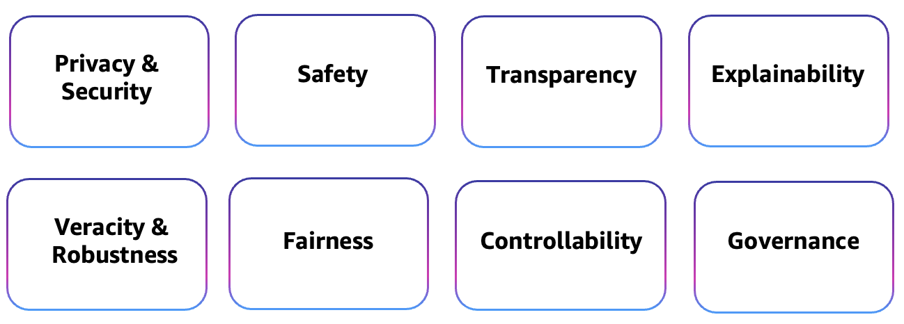

# Responsible AI in the Generative AI Era

## Responsible AI Pillars:

## Tools:

- [Google Model Explorer](https://ai.google.dev/edge/model-explorer)

## Regulations

#### GDPR - General Data Protection Regulation

There are two key parties under the GDPR, each with key compliance responsibilities.

- **Data Controler**: decides why and how personal data is processed. The data controler is the principal entity with obligations imposed by the regulation. Obligations might apply from the moment the it starts to collect personal data about individuals.

- **Data Processor**: is a subcontractor to the data controler, normaly responsible for processing personal data on behalf of the data controler.

##### Key obligations under the GDPR in relation to generative AI solutions:

Below are some key obligations described in [GDPR & Generative AI ][ref1].

**Transparency (Article 12 - 14):** data controler needs to provide data subjects with certain key information about how personal data will be used (e.g. privacy notice). 

**Data Subject Rights (Articles 15 - 21):** data controlers must ensure a position to comply with their obligation to respond to requests from data subjects in relation to the exercise of their rights with assistance from data processors.

**Processor Obligations (Article 28):** data controlers should use data processors to process personal data on their behalf only when sufficient guarantees exists to meet key requirements of the GDPR. These key requireements are:

- only use subprocessors with the consent of the data controller and remain liable for subprocessors;
- process personal data only on instructions from the data controller, including with regard to transfers
- ensure that persons who process personal data are committed to éconfidentiality;
- implement appropriate technical and organizational measures to ensure a level of personal data security appropriate to the risk;
- assist the data controller in its obligations to respond to data subjects’ requests to exercise their GDPR rights;
- meet the GDPR’s breach notification and assistance requirements;
- assist the data controller with data protection impact assessments and consultation with supervisory authorities;
- delete or return personal data at the end of provision of services; 
- support the data controller with evidence of compliance with the GDPR.

**Technical and Organizational Security Measures (article 32):** data controlers and data processors need to implement technical and organizational measures to ensure a level of security appropriate to the risk taking into account the nature, scope, context and purpose of the processing of personal data. 

**Data Protection Impact Assessments (Article 35):**  data controllers to undertake a data privacy impact assessment (DPIA) when processing personal data.

**Transfers of Personal Data to Third Countries (Article 44-50):** The GDPR permits personal data to be transferred to a third country outside of the EU or EEA (including the US) where certain conditions have been satisfied. These conditions include where there has been an adequacy decision by the European Commission or where appropriate additional safeguards (such as the EU Standard Contractual Clauses) have been put in place.

**Nice to know:**

-  The EDPB - European Data Processor Board recognises that it is compliant to use a cloud providers´s standard terms. Thus no need for data controlers to create their own data protection terms towards their data processors. 

#### EU AI Act

TBD

## References:

- [ref1]: https://wwps.microsoft.com/wp-content/uploads/2024/04/GDPR-and-Generative-AI-A-Guide-for-the-Public-Sector-FINAL.pdf GDPR & Generative AI - A guide for public sector by Microsoft, April 2024

