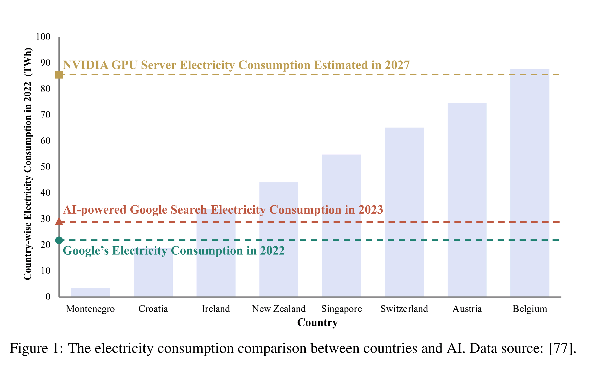

# Sustainability in the world of AI/ML

## What is Sustainability?

## Examples of how we are doing it?

Picture form [2]

## References:

[1] The growing energy footprint of artificial intelligence, by Alex De Vries

[2] A Survey of Resource Efficient LLM and Multimodal Foundation Models, [GitHub repo](https://github.com/UbiquitousLearning/Efficient_Foundation_Model_Survey) 

