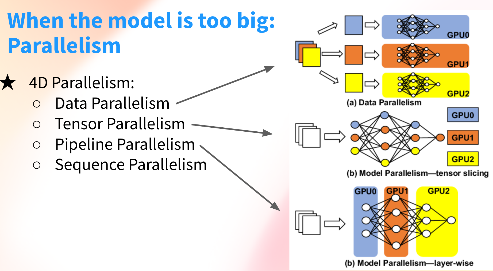

# Traininig LLMs

What

How:

## Types of distributed trainning:

Parallelism to the rescue when the model is too big.

Picture by Thomas from HuggingFace (ref. [4])

### Data Parallelism

### Tensor Parallelism

### Pipeline Parallellism

 

## Definition:

#### [Activation Checkpointing](https://docs.aws.amazon.com/sagemaker/latest/dg/model-parallel-extended-features-pytorch-activation-checkpointing.html): 

Also known as gradient checkpoint is a technique to reduce memory usage by clearing activations of certain layers and recomputing them during a backward pass. **Tradeoff between memory usage and extra computation time.** 

If module is checkpoint, at the end of a forward pass the inputs to and outputs from the module stay in memory.

#### [Activation Offloading](https://docs.aws.amazon.com/sagemaker/latest/dg/model-parallel-extended-features-pytorch-activation-offloading.html): 

When activation checkpointing and pipeline parallelism are turned on and the number of microbatches is greater than one, *activation offloading* is an additional feature that can further reduce memory usage. 

Activation offloading asynchronously moves the checkpointed activations corresponding to their microbatches that are not currently running in the CPU. Right before the GPU needs the activations for the microbatch’s backward pass, this functionality prefetches the offloaded activations back from the CPU.

### [MiCS - Minimizes the Communication Scale](https://arxiv.org/pdf/2205.00119.pdf) : 

MiCS reduces the communication overhead by decreasing the number of participants in a communication collective.

## References:

[1] Github: Train Falcon with near-linear scaling using Sharded Data Parallelism technique in SageMaker Model Parallelism Library ([here](https://github.com/aws/amazon-sagemaker-examples/tree/main/training/distributed_training))

[2] Blog: [Train gigantic models with near-linear scaling using sharded data parallelism on Amazon SageMaker](https://aws.amazon.com/blogs/machine-learning/train-gigantic-models-with-near-linear-scaling-using-sharded-data-parallelism-on-amazon-sagemaker/) 

[3] Paper: [MiCS: Near-linear Scaling for Training Gigantic MOdel on Public Cloud.](https://arxiv.org/pdf/2205.00119.pdf)

[4] Presentation: [Little guide to building Large Language Models in 2024](https://docs.google.com/presentation/d/1IkzESdOwdmwvPxIELYJi8--K3EZ98_cL6c5ZcLKSyVg/edit#slide=id.g2c144c77cfe_0_751)